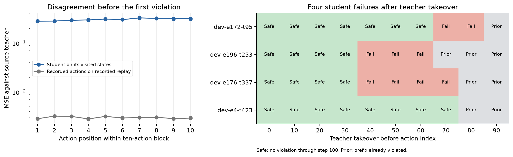

# Teacher diagnosis of the four remaining development failures

On 4 October 2026, the original source teachers avoided health violations on all
24 development starts when acting every simulator step. Teacher takeover before
action 30 also prevented all four failures of the mixed-demonstration student.
The student disagreed substantially with its teacher even on the first action of
each block. These results motivate improving imitation on student-visited states;
they do not establish that changing the observation interval alone will fix control.

This is a diagnostic of the previously inspected development set, not a new safety
confirmation. **Gate 0 was not rerun, and no controller was trained.**

## Fixed comparison and provenance

Protocol and implementation were committed as bfa4bb1 before teacher queries or
interventions. The source is the coverage bundle at private Hugging Face revision
aab43ddcba2c1209453121a705ecf10c21a560a2. Actors come from the pinned original
42-policy ladder. Each root uses the exact actor named by its source episode,
with the exported observation normalisation and action clipping, and zero action noise.

Every takeover replays the student's original actions from the root to a fixed
boundary, then uses that teacher through the same 100-step horizon. This preserves
the solver warm start; resetting only the boundary pose and velocity would not.
All 24 saved student trajectories were reproduced bitwise in both pose and velocity,
and all 240 intervention prefixes matched them bitwise. Earlier prefix violations
remain counted after takeover. We tested boundaries 0, 10, ..., 90 on every root.

Teachers receive privileged simulator observations at 125 Hz. Their performance is
a diagnostic reference, not a latent-controller result. The held-action reference
updates the executed teacher action every ten steps and repeats it. That differs from the
student, which predicts ten distinct actions per block; it cannot establish that
sequential block control itself is inadequate.

## Outcomes

| Controller or replay | All violations | PPO starts | PPO-Lagrangian starts | Mean progress in metres |
|---|---:|---:|---:|---:|
| Recorded action replay | 0/24 | 0/8 | 0/16 | 2.110 |
| Mixed student | 4/24 | 2/8 | 2/16 | 2.093 |
| Teacher acting every step | 0/24 | 0/8 | 0/16 | 2.109 |
| Teacher action held for ten steps | 22/24 | 8/8 | 14/16 | 1.913 |

The per-step teachers retained 99.96%
of recorded progress. Zero failures in 24 already-inspected starts is not a safety
guarantee. Holding teacher actions caused 22/24 failures, confirming that the
teacher's actions generally cannot be held for ten steps.

## Teacher takeovers on the four failed trajectories

| Root | Source teacher | Student first unsafe transition index | Latest tested safe takeover index |
|---|---|---:|---:|
| dev-e172-t95 | PPOLag-e130 | 87 | 60 |
| dev-e196-t253 | PPO-e190 | 66 | 30 |
| dev-e176-t337 | PPO-e110 | 74 | 30 |
| dev-e4-t423 | PPOLag-e200 | 77 | 70 |

Indices are zero based. Takeover at 30 occurs before action 30, after 30 student
actions. A first unsafe transition at 66 means that the state after action 66 is
unsafe. Safe means no violation through the original segment endpoint; the horizon
was not extended after takeover.

Takeovers at 0, 10, 20 and 30 produced zero failures across all 24 roots. Counts at
40, 50, 60, 70, 80 and 90 were 2, 2, 2, 3, 4 and 4. The two PPO teachers failed
when started at boundary 40 even though their student prefixes had not yet violated.
This suggests that waiting for a health violation is too late for these particular
teachers and trajectories. Failed teacher recovery is not proof of irreversibility,
and the coarse boundary grid does not identify a precise recovery deadline.

## Action disagreement

On the student's visited states, mean action MSE against the noiseless source
teacher was 0.30622, using 2308
actions up to and including the first violating transition. Recorded-action replay
gave 0.00302 against its teacher on its own states.
The latter includes the collection noise and is a reference, not a noise term that
can simply be subtracted from the student's error.

Student MSE was 0.28288 on the first position and 0.31629 on the tenth. Thus
substantial disagreement exists when a fresh block is first selected. It is not
confined to its later actions. A post-hoc check using the same 228 complete
pre-failure blocks at every position gives 0.27881 and
0.31629, respectively. Position-wise counts, family breakdowns
and that descriptive check are saved in [diagnostic.json](diagnostic.json) and
[analysis.json](analysis.json).

Teacher disagreement is not uniquely wrong action selection: multiple gaits can
be safe, and the mixed student imitates many teachers without receiving teacher
identity. The intervention results make imitation on visited states a useful
hypothesis to test, but do not separate representation, capacity, conflicting
teacher targets and distribution shift.

## Recommended next experiment

Keep the latent representation and ten-action interface fixed first. Compare an
equal-budget baseline with teacher-labelled action blocks collected from student
rollouts starting only in the established fit episodes. Query the source teacher
from those visited states to produce a sequential ten-action target, and count
every student rollout, replay prefix and teacher branch step. Preserve whole-episode
validation and keep these 24 development episodes out of fitting.

Declare the target sampling, teacher assignment, replay mixture and model-selection
rule before collection. This would test whether targeted imitation data improves
closed-loop control. The current diagnostic provides no new starting policy and no
basis for proceeding to transfer checks or evolution yet.

## Verification and resources

The full suite passed: 621 tests, no failures or skips, with 49 existing warnings.
Ruff passed. Three new tests check bitwise action-tape replay despite teacher queries,
takeover and action-hold timing with exact prefix preservation, and exclusion of
post-failure states from action-error summaries.

The scientific run took 7.67 seconds and used exactly
31,200 new simulator steps and 31,200 teacher queries: 2,400 each for mixed replay,
recorded replay and held-teacher control, plus 24,000 for 240 complete takeover
segments. It used no new rendering, encoding, imagined rollout or optimiser update.
Test costs are separate. Source experiment costs remain recorded as provenance.

[rows.json](rows.json) holds all paired outcomes; [manifest.json](manifest.json)
pins inputs, source hashes, teacher weights, code and accounting.
Dense trajectories are in the ignored local run bundle runs/walker2d-evo-s2-teacher-20261004-1/.
An archive receipt records the private remote revision once uploaded.

Reproduce the diagnostic and report with a new run ID:

    uv run python experiments/scripts/evo_teacher_diagnostic.py --run-id NEW_RUN_ID
    uv run python experiments/scripts/evo_teacher_report.py --run-id NEW_RUN_ID
