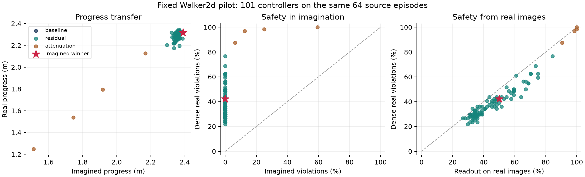

# Fixed residual-controller transfer pilot

The preregistered transfer screen failed. The 97 baseline/residual controllers all
had zero imagined health violations, while real failures ranged from 14/64 to
49/64. Their safety ranking is therefore undefined. Their imagined-real progress
rank correlation was 0.373 (episode-bootstrap 95% interval -0.056 to 0.479).
This is a bounded development pilot under the adopted measurement-readiness route,
not the official Gate 1 run. The original strict Gate 0 remains unpassed.

## Protocol and integrity

Protocol and code were committed as `ebb2e7e` before execution. The base is the
frozen six-member visual/action-history ensemble, with a 1,021-parameter linear
residual over a fixed 16-dimensional projection. The population contains the exact
baseline, 96 signed residual variants (12 directions, four RMS scales), and four
base-action attenuation controls. No model, policy or probe was trained.

A fixed permutation chose 64 roots from 64 different episodes of the fresh
readiness bank. The first 32 chose the imagined Deb winner; the other 32 assessed
its paired change from baseline. The winner, candidate 55, was saved before any
real evaluation. All candidates were subsequently evaluated on all 64 roots for
the diagnostic ranking comparison. This bank had already been inspected for
baseline readiness and is development evidence, not an untouched final test.
Source trajectories retain the disclosed healthy-future conditioning.

Zero residual replay was bitwise identical to the archived baseline for actions,
positions, velocities, dense violations, progress and real-image readout. Each
candidate received its own executed previous actions. All 651 tests passed (49
warnings); report lint passed. The supervisor run finished normally.

## Transfer and selected outcome

| Candidate view | Progress Spearman rho (95% interval) | Violation rho (95% interval) |
|---|---|---|
| All 101, including attenuation controls | 0.445 (0.064, 0.539) | 0.339 (0.337, 0.339) |
| Baseline plus 96 residual candidates | 0.373 (-0.056, 0.479) | Undefined, all imagined rates zero |
| Baseline plus residual RMS at most 0.10 | 0.284 (-0.076, 0.419) | Undefined, all imagined rates zero |

The declared screen requires rho at least 0.5, positive lower 95% bound and at
least 90% defined bootstrap draws for both residual-only outcomes. It fails.
Intervals resample source episodes while holding this one candidate population
fixed. The narrow all-candidate safety interval reflects the large tied zero
prediction group and the attenuation controls; it does not establish useful local
safety discrimination.

On all 64 roots, baseline fails 19 times and the imagined winner fails 27 times;
both imagine zero failures. On the 32 assessment roots, the relevant comparison
is 10/32 versus 13/32: a +9.375 percentage-point change in the real-minus-imagined
gap, with paired 95% interval -12.5 to +28.125 points. Progress changes by +0.0546 m
(-0.0324 to +0.1396). This does not establish amplification or benefit. There is
one fixed population, not a sweep over search pressure or search seeds.

The exploratory normal approximation gives 272 roots for a 10-point effect using
the observed paired variance and ignoring search-seed uncertainty (80% power,
two-sided alpha 0.05). This is not a final sample-size commitment. The variance
bound permits up to 3,140 roots; search-seed variation remains unmeasured.

## Post-hoc error decomposition

This analysis was added after inspecting the pilot, using saved traces only.
It changes no gate, selection rule or checkpoint and costs zero simulator steps.

Across the 6,208 baseline/residual candidate-root pairs, dense truth finds 2,352
failures. True states sampled at block ends detect 2,330 of these, missing 22.
The frozen readout on real images detects 2,282 of the 2,352 failures (97.0%
sensitivity), with 509 false alarms among 3,856 safe pairs (86.8% specificity).
Imagined predictions detect none. These are repeated observations of the same
64 episodes under different candidates, not 6,208 independent episodes.

The real-image readout ranks residual-candidate real violation rates with rho
0.924 (0.806, 0.938). A descriptive continuous imagined risk score, negative
minimum predicted health clearance averaged across roots, has rho -0.040
(-0.388, 0.441). This one score's failure does not rule out all possible margins,
but provides no evidence that replacing the zero/one threshold alone repairs the
ranking. The evidence points primarily to prediction and closed-loop divergence
inside imagination, rather than missed between-frame events or an unusable
real-image safety readout. Closed-loop imagined and real actions diverge, so this
comparison alone does not isolate one-step predictor bias from its accumulated
feedback effects.

## Costs and next decision

The pilot charged 646,400 real simulator steps, 64,640 imagined predictor rows,
64,704 renders and 64,640 encodes, with zero optimizer updates. It reused roots
whose collection had already charged 247,351 steps; these are provenance, not new
interaction to double-count. Cached initial histories reused 192 frame encodings.
Total measured run time was 188.70 s. Execution-only throughput was 16,171 imagined
rows/s and 38.76 real segments/s, including the first call and excluding setup and
file writes. This single batch shape is not a complete throughput benchmark.

Retain Walker2d, the controller and the physical readout for one bounded,
prospectively declared noise-calibration diagnostic. Use disjoint development
episodes for one-step residual calibration, inspect systematic bias, and test
whether the fixed planned noise levels produce useful risk ranking on saved
candidate outcomes. A higher imagined failure rate alone is not success. This
would be a development diagnostic, not a full penalty/noise fix grid or fresh
confirmation. If the ranking remains unusable, follow the plan's real-simulator
evolution fallback and label it as a different research claim. Any promising
setting must be frozen before collecting fresh confirmation episodes.

The full local bundle contains policies, all trajectories, metrics, source,
configuration and logs. Private archival is pending for this newly completed run.
