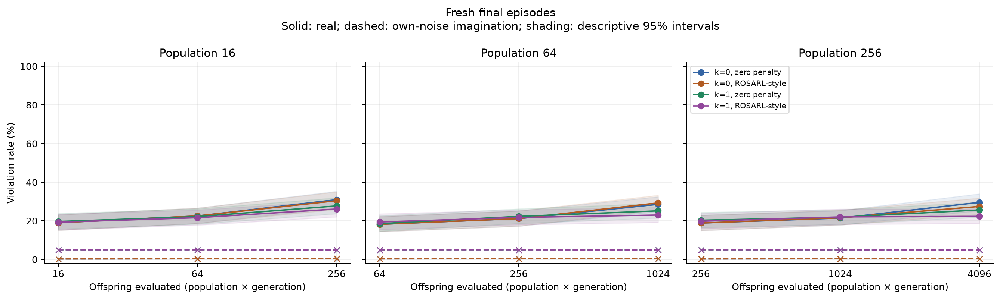
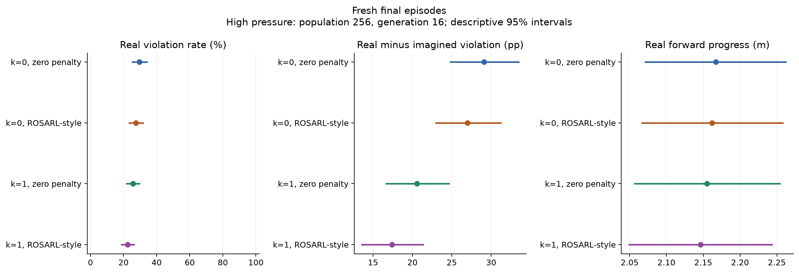

# Readiness results: walker2d-evo-s5-main-20261004-1

Fresh final episodes.

The study used 20 paired search seeds and 320 independent source episodes. Uncertainty resamples search seeds and source episodes independently, retaining pairing across all arms. The product of seed and episode counts is not the number of independent episodes.

The shared frozen baseline's real violation rate was 16.88% [12.81, 21.25] (descriptive 95% interval).

| Declared contrast | Estimate [97.5% interval], pp | Direction supported |
|---|---:|---|
| k=0 zero-penalty gap, high minus low pressure | 10.39 [6.70, 14.25] pp | True |
| Combined method minus k=0 zero-penalty gap amplification | -7.22 [-12.18, -2.49] pp | True |

The two co-primary intervals use Bonferroni family coverage of 95%. These are the locked final-study contrasts.

At high pressure, the combined method's real failure difference is -7.20 [-10.98, -3.70] pp and its ratio of mean real progress is 0.99 [0.98, 1.00] (descriptive paired 95% intervals). Both declared practical conditions supported: True. The practical criterion requires the real-failure difference's upper interval endpoint below zero and the progress ratio's lower endpoint at least 0.90. A smaller prediction gap alone does not establish a real safety improvement.

Incremental run cost: 444,403,200 predictor rows, 23,567,921 real simulator steps, 0 gradient updates and 6.819 elapsed hours. These are incremental costs; original asset training, data collection and prior development runs are additional.

Historical Gate 0 and the transfer screen remain failures. Inference is conditional on the frozen assets, fitness/selection banks and source distribution. The branches are 0.8 seconds long and do not establish safe full-episode control. A degenerate bootstrap interval does not prove zero population risk. Every declared cell is included in `all_cells.csv`; rates there are fractions, not percentages.

The [scoped cost ledger](cost_ledger.json) records 26,838,972 real steps across preserved evolution runs, including this run. The shared original set-A, probe and root data add 3,600,058 collection steps. The original world model reached optimizer index 214,780. PPO/PPO-Lagrangian training interactions and some older failed-run costs remain unquantified, so these records do not establish a complete lifetime cost.
