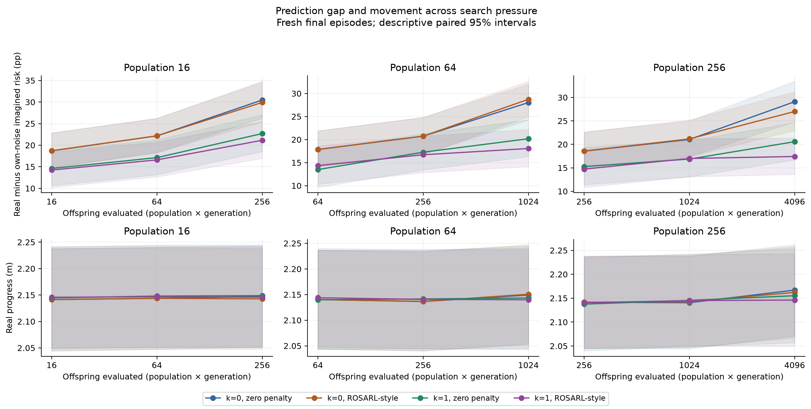
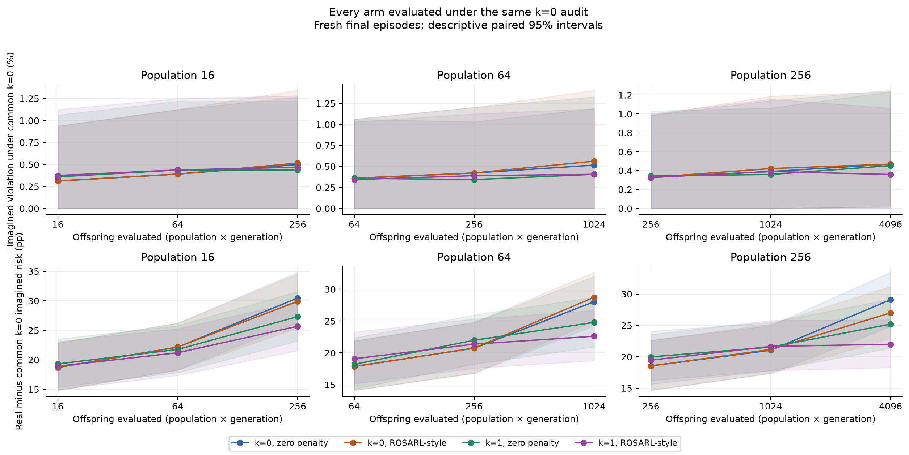
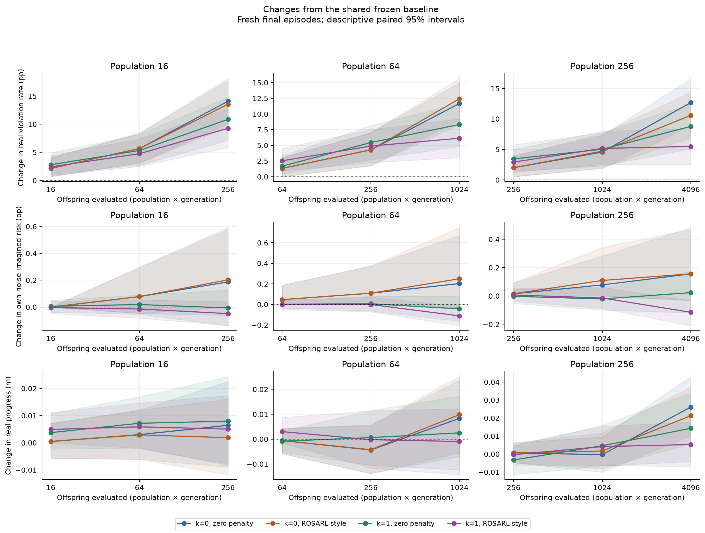
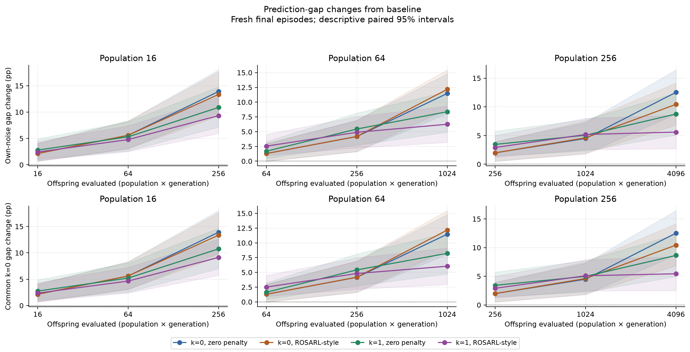

# Declared descriptive reporting supplement

These figures complete the pressure curves, common-noise audits, and baseline-change views requested in the readiness declaration. They use the completed study and the same paired crossed-seed/episode bootstrap. No model or simulator queries were made. All intervals here are descriptive 95% intervals; they do not replace either adjusted primary comparison.

The original analysis already contains the factorial contrasts and most plotted intervals. Intervals for common-k0 imagined rates, imagined-rate changes, absolute progress changes, and all 20 equal-offspring pairwise comparisons were rendered after study completion from saved paired arrays. Their reporting was motivated by the declaration, and no final outcome selected which cells to include. Equal offspring counts are not equal predictor-query costs across noisy and noiseless arms.

| High-pressure paired comparison | Actual failure difference, pp [95% interval] | Progress ratio [95% interval] |
|---|---:|---:|
| penalty_at_k0 | -2.09 [-5.39, 0.59] | 1.00 [0.99, 1.00] |
| penalty_at_k1 | -3.30 [-6.16, -0.48] | 1.00 [0.99, 1.00] |
| noise_at_zero_penalty | -3.91 [-7.81, -0.05] | 0.99 [0.99, 1.00] |
| noise_at_rosarl | -5.11 [-8.55, -2.02] | 0.99 [0.99, 1.00] |

The penalty-only k=0 real-failure interval includes zero. The penalty-at-k=1 and both conditional noise contrasts have negative real-failure intervals. These conditional contrasts do not establish a statistically tested interaction or universal superiority. Baseline comparisons continue to show that evolution worsened safety relative to the frozen starting controller.

All [equal-offspring comparisons](matched_budget_contrasts.json), [factorial contrasts](descriptive_factorial_contrasts.json), and [diagnostic cell estimates](all_diagnostic_cells.csv) are included. The data are 320 independent episodes crossed with 20 seeds, not 6,400 independent episodes. Historical gate failures and short-branch limitations remain unchanged.
