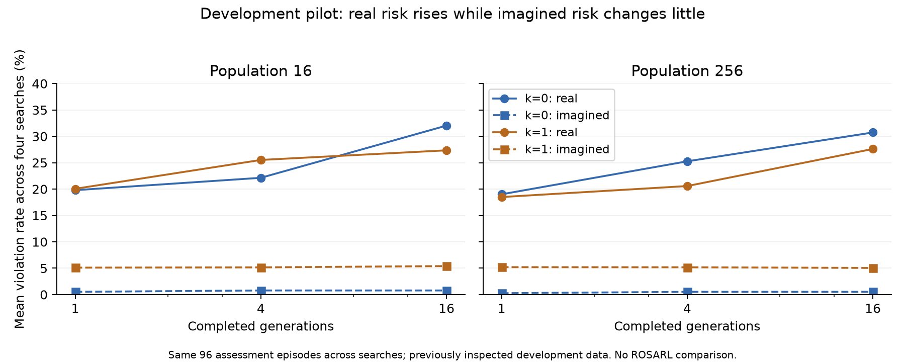

# Bounded readiness search/power pilot

The preregistered development contrast supports continuing to fresh-episode
confirmation: stronger k=0 search increased the real-minus-imagined violation gap
by **10.94 percentage points** (exploratory crossed-bootstrap 95% interval **1.30
to 20.31 pp**). This is a four-seed pilot on 96 previously inspected assessment
episodes, not a confirmatory result or a passed historical gate.

The run completed normally in 1,539.25 seconds (25.65 minutes). All declared cost
assertions passed. Source/configuration were committed as `9c043c1` before launch.
Strict Gate 0 and the joint transfer screen remain reported failures. No further
controller repair, ROSARL comparison or final-episode collection occurred.

## What ran

Four paired seeds, populations 16 and 256, and 16 generations at each of k=0 and
k=1 produced 16 searches and 48 checkpoint selections. The existing 256-episode
readiness bank was partitioned into 96 fitness, 64 selection and 96 assessment
episodes. All were previously inspected development data. A checkpoint selected
only among the baseline and generation nominees on the separate fixed selection
bank. All 48 parameter vectors were frozen before any new real assessment.

Both arms used first-imagined-violation return truncation and zero extra unsafe
penalty. The residual controller's base gain remained one. The frozen world model,
physical probe, calibrated noise scale and initial controller were not retrained.
The [prospective protocol](../../../protocols/stage5-power-pilot-20261004.md)
contains the complete design and accounting rules.

## Results

Low pressure means population 16, generation 1. High pressure means population
256, generation 16. Positive gap change means more real failures relative to the
model's predictions.

| Declared contrast, high minus low | Estimate | Exploratory 95% interval |
|---|---:|---:|
| k=0 gap change | +10.94 pp | +1.30 to +20.31 pp |
| k=0 real-failure change | +10.94 pp | +2.08 to +19.79 pp |
| k=1 gap change | +7.61 pp | -2.50 to +19.33 pp |
| k=1 real-failure change | +7.55 pp | -2.34 to +19.27 pp |
| k=1 minus k=0 gap amplification | -3.33 pp | -12.83 to +6.39 pp |

At k=0, real failures rose from 19.79% to 30.73%, while mean imagined failures
were 0.52% at both endpoints. Real progress rose from 2.0575 to 2.1175 m per
segment, so greater real risk did not result from a collapse of forward progress.
All four seed-specific gap increases were positive: 12.50, 12.50, 3.13 and 15.63 pp.

At k=1, real failures rose from 20.05% to 27.60%, while imagined failures remained
about 5%. Noise alone did not demonstrate reduced amplification; its difference
interval includes zero and effects in either direction. Its safety probabilities
remain substantially too optimistic. This pilot does not test noise plus ROSARL.

The figure shows descriptive seed means. Formal pilot contrasts and intervals are
in [pilot.json](pilot.json). Bootstrap resampling crosses search seeds and episodes,
with the same resampled indices across paired arms. The intervals are nominal 95%
and exploratory, not adjusted confirmation of the main draft's two endpoints.

| Noise k | Population | Generation | Real violations | Imagined violations | Gap | Real progress (m) |
|---|---:|---:|---:|---:|---:|---:|
| 0 | 16 | 1 | 19.79% | 0.52% | 19.27 pp | 2.0575 |
| 0 | 16 | 4 | 22.14% | 0.78% | 21.35 pp | 2.0623 |
| 0 | 16 | 16 | 32.03% | 0.78% | 31.25 pp | 2.1047 |
| 0 | 256 | 1 | 19.01% | 0.26% | 18.75 pp | 2.0726 |
| 0 | 256 | 4 | 25.26% | 0.52% | 24.74 pp | 2.0668 |
| 0 | 256 | 16 | 30.73% | 0.52% | 30.21 pp | 2.1175 |
| 1 | 16 | 1 | 20.05% | 5.10% | 14.95 pp | 2.0723 |
| 1 | 16 | 4 | 25.52% | 5.16% | 20.36 pp | 2.0771 |
| 1 | 16 | 16 | 27.34% | 5.40% | 21.94 pp | 2.0939 |
| 1 | 256 | 1 | 18.49% | 5.20% | 13.29 pp | 2.0592 |
| 1 | 256 | 4 | 20.57% | 5.18% | 15.40 pp | 2.0671 |
| 1 | 256 | 16 | 27.60% | 5.05% | 22.56 pp | 2.0853 |

Each cell averages four searches evaluated on the same 96 assessment episodes.
There are 96 independent source episodes, not 384. The baseline failed 19/96
segments and progressed 2.0672 m on average. Population effects are not uniformly
monotone: the k=0 population-16 endpoint is riskier than population 256. The declared
combined high-versus-low contrast is supported; a universal monotone population
law is not established.

## Engineering validation and costs

The archived zero-residual imagined control matched actions and readouts exactly.
Real baseline replay matched actions, qpos, qvel, progress, dense violations and
readouts bitwise. The separate [full-model resume validation](../../stage5-resume-check/walker2d-evo-s5-resume-check-20261004-1/README.md)
then matched interrupted and uninterrupted k=0/k=1 searches exactly. The full
project suite passed with 661 tests and 49 warnings. Ruff passed.

| Charged item | Count |
|---|---:|
| Predictor rows | 30,980,480 |
| Real simulator steps | 470,400 |
| Candidate fitness evaluations | 34,816 |
| CMA generations | 256 |
| Renders / encodes | 47,104 / 47,040 |
| New collection steps / gradient updates | 0 / 0 |

These are incremental pilot costs. Earlier collection, model training and
validation costs remain chargeable when reporting total study cost. The separate
resume check cost another 4,400 predictor rows, with zero real steps.

Median fitness-generation times from seeds two and three were 0.61/9.81 s at
k=0 for populations 16/256, and 0.63/10.14 s at k=1. Full-suite validation overlapped
the first and fourth seeds; the resume check also overlapped the fourth. These
observations support feasibility but are not a dedicated benchmark of the larger
main evaluation batches. Timing records and exclusions are in
[report_summary.json](report_summary.json).

## Decision and next steps

Continue with Walker2d and the frozen controller. Preserve strict Gate 0 and the
joint transfer screen as failures. The pilot provides initial evidence for the
selection-amplification question, so neither another controller repair nor a new
environment is the next step. Retain k=1 as the proposed noisy arm, with k=0 as
its comparison. Do not describe noise as a demonstrated fix.

Complete the main runner and have the readiness extension and observed-return
ROSARL adaptation reviewed. The four-arm design remains k=0/k=1 crossed with
zero extra penalty/ROSARL-style penalty, using matched termination. Before collecting
any final episodes, freeze all scoring, role splits, seeds, budgets and endpoints.
Use new whole episodes for fitness, policy selection and final evaluation.

The draft's ten paired seeds and 320 final episodes remain a minimum planning
candidate, not a power guarantee. The pilot plug-in model predicts 99.0% power
for a 10-point k=0 effect at those counts, but only four seed observations inform
its variance components. One component for the noise contrast was truncated to
zero; its near-100% plug-in power is especially fragile. ROSARL seed variance was
not measured. Prefer more search seeds if the checked runtime permits, and use a
small declared ROSARL development pilot after scientific review to size that
contrast before the fresh-bank main launch. Do not select sample size from main
outcomes or retune noise after inspecting them.

If fresh-episode confirmation is flat or the penalty does not help, report the
intervals, persistent model overconfidence and detection limits. Preserve the
same endpoints and interpretation rules. No publication outcome is assumed.

The full bundle is local. No upload or supervisor approval is claimed.
