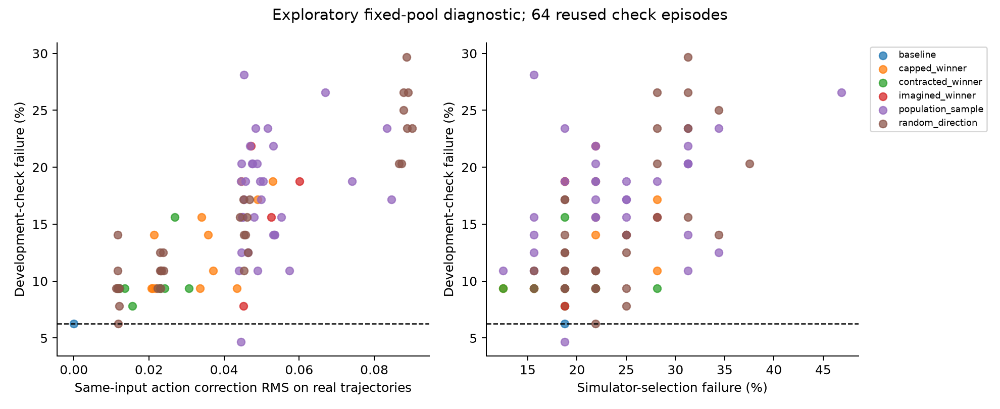

# Walker candidate-quality development diagnostic

All results reuse development episodes. The candidate pool and selectors were frozen before their respective simulator queries. Candidate rows are correlated; intervals are exploratory and unadjusted. These 0.8-second branches do not establish full-episode controller improvement.

The fixed pool contains 89 variants. The starting controller failed on 6.25% of 64 check episodes. 13 candidates met the empirical improvement criterion on selection episodes, 1 on check episodes, and 0 on both. The latter counts use retrospective check outcomes and are not validated selections.

| Frozen selector | Candidate | Check failure difference, pp [95%] | Progress ratio [95%] |
|---|---|---:|---:|
| simulator/all | candidate-031 | +3.12 [+0.00, +7.81] | 0.990 [0.978, 1.000] |
| imagined_k0_zero/all | candidate-001 | +12.50 [+4.69, +21.88] | 1.006 [0.984, 1.027] |
| imagined_k1_fixed/all | candidate-001 | +12.50 [+4.69, +21.88] | 1.006 [0.984, 1.027] |
| simulator/capped_winner | candidate-033 | +3.12 [+0.00, +7.81] | 0.993 [0.980, 1.005] |
| imagined_k0_zero/capped_winner | candidate-006 | +12.50 [+4.69, +21.88] | 1.004 [0.983, 1.025] |
| imagined_k1_fixed/capped_winner | candidate-006 | +12.50 [+4.69, +21.88] | 1.004 [0.983, 1.025] |
| simulator/contracted_winner | candidate-031 | +3.12 [+0.00, +7.81] | 0.990 [0.978, 1.000] |
| imagined_k0_zero/contracted_winner | candidate-003 | +3.12 [+0.00, +7.81] | 1.008 [0.994, 1.023] |
| imagined_k1_fixed/contracted_winner | candidate-003 | +3.12 [+0.00, +7.81] | 1.008 [0.994, 1.023] |
| simulator/imagined_winner | candidate-000 | +0.00 [+0.00, +0.00] | 1.000 [1.000, 1.000] |
| imagined_k0_zero/imagined_winner | candidate-001 | +12.50 [+4.69, +21.88] | 1.006 [0.984, 1.027] |
| imagined_k1_fixed/imagined_winner | candidate-001 | +12.50 [+4.69, +21.88] | 1.006 [0.984, 1.027] |
| simulator/population_sample | candidate-036 | +4.69 [-1.56, +12.50] | 0.997 [0.980, 1.012] |
| imagined_k0_zero/population_sample | candidate-021 | +9.38 [+3.12, +17.19] | 0.980 [0.963, 0.995] |
| imagined_k1_fixed/population_sample | candidate-037 | +15.62 [+7.81, +25.00] | 1.012 [1.000, 1.026] |
| simulator/random_direction | candidate-065 | +3.12 [+0.00, +7.81] | 1.001 [0.995, 1.006] |
| imagined_k0_zero/random_direction | candidate-084 | +20.31 [+9.38, +31.25] | 1.032 [1.004, 1.059] |
| imagined_k1_fixed/random_direction | candidate-064 | +20.31 [+10.94, +31.25] | 0.999 [0.980, 1.020] |

Incremental cost: 854,400 real steps, 768,960 predictor rows, 6.43 minutes. Zero gradient updates and zero new source-collection steps; historical collection, training and parent-search costs remain additional.

All 534 query archives verified. The complete analysis and all frozen selectors reproduced exactly. Both baseline replays matched the earlier development run bitwise. See analysis.json for every candidate and the dense/endpoint/readout decomposition.

