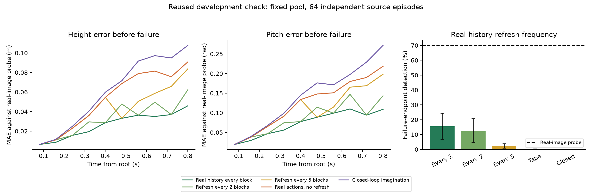
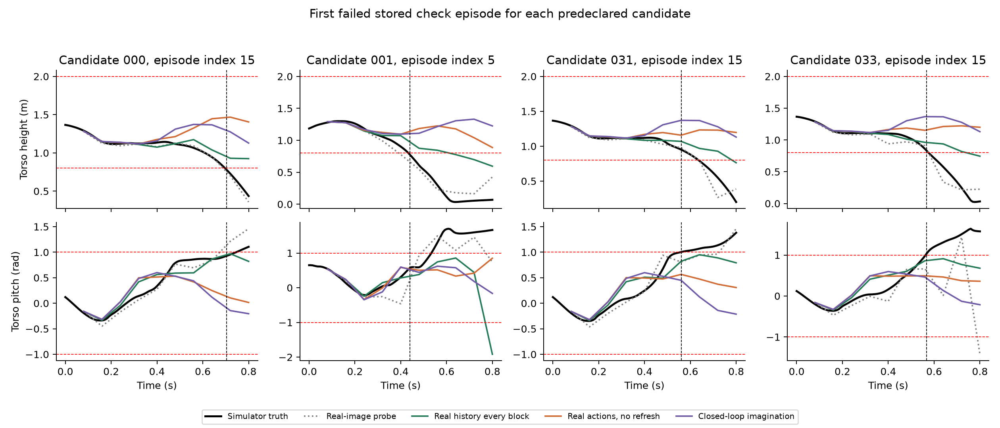

# Where Walker imagination diverges before real failure

This is an exploratory retrospective diagnostic on the complete fixed 89-candidate pool and previously exposed source episodes. No new simulator steps or controller updates were performed. Refreshed histories and real future action tapes are privileged diagnostics, not deployable fixes or root-time risk predictions.

## real_selection

664 failed candidate/episode pairs across 26 of 32 source episodes. There are 2848 correlated pairs, not that many independent episodes. 653 first-failure-containing block ends were unsafe. Real-image readout detected 90.2% [82.6, 95.4] of those endpoints.

| Prediction path | Failure-endpoint detection [95%] | Divergence strictly before failure [95%] | Median lead when present |
|---|---:|---:|---:|
| Real history every block | 15.0% [5.0, 31.4] | 100.0% [100.0, 100.0] | 376 ms |
| Refresh every 2 blocks | 11.5% [1.8, 30.1] | 100.0% [100.0, 100.0] | 384 ms |
| Refresh every 5 blocks | 3.1% [0.2, 9.3] | 100.0% [100.0, 100.0] | 392 ms |
| Real actions, no refresh | 0.2% [0.0, 0.5] | 100.0% [100.0, 100.0] | 392 ms |
| Closed-loop imagination | 0.0% [0.0, 0.0] | 100.0% [100.0, 100.0] | 392 ms |

Intervals resample whole source episodes and are conditional on this fixed candidate pool. Divergence means height error >0.05 m or pitch error >0.1 rad against the real-image probe. Only endpoints strictly preceding the dense event count. Detection uses the endpoint of the block containing the first dense event, which can follow that event by up to 72 ms. See analysis.json for threshold sensitivity, physical versus readout errors, and denominators.

## evaluation

861 failed candidate/episode pairs across 43 of 64 source episodes. There are 5696 correlated pairs, not that many independent episodes. 819 first-failure-containing block ends were unsafe. Real-image readout detected 69.8% [51.9, 84.7] of those endpoints.

| Prediction path | Failure-endpoint detection [95%] | Divergence strictly before failure [95%] | Median lead when present |
|---|---:|---:|---:|
| Real history every block | 15.6% [6.9, 24.5] | 99.9% [99.6, 100.0] | 256 ms |
| Refresh every 2 blocks | 12.3% [4.8, 20.8] | 100.0% [100.0, 100.0] | 280 ms |
| Refresh every 5 blocks | 2.2% [1.0, 4.0] | 100.0% [100.0, 100.0] | 312 ms |
| Real actions, no refresh | 0.1% [0.0, 0.5] | 100.0% [100.0, 100.0] | 312 ms |
| Closed-loop imagination | 0.0% [0.0, 0.0] | 100.0% [100.0, 100.0] | 328 ms |

Intervals resample whole source episodes and are conditional on this fixed candidate pool. Divergence means height error >0.05 m or pitch error >0.1 rad against the real-image probe. Only endpoints strictly preceding the dense event count. Detection uses the endpoint of the block containing the first dense event, which can follow that event by up to 72 ms. See analysis.json for threshold sensitivity, physical versus readout errors, and denominators.

## Verification and cost

All 178 new query archives verified. All 89 original k0 check-bank readouts reproduced bitwise. Dense event times and latent errors were recomputed. New cost: 427,200 predictor rows; 46.79 seconds in the corrected process, 4.34 minutes on the inherited budget clock (including the retained zero-query failure and repair interval); zero simulator steps, renders, image encodes and gradient updates. Parent simulator and training costs remain additional.

See [interpretation](INTERPRETATION.md) and timing_supplement.json for healthy-trajectory exceedances and eventual versus immediate probe detection. These post-run checks are descriptive.

