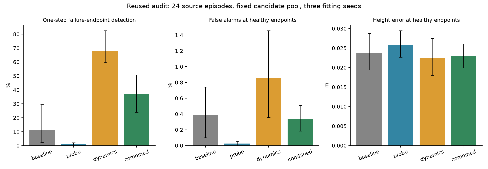

# Walker predictor and probe repair

Exploratory fitting and audit on previously exposed episodes. Four disjoint groups of 24 whole source episodes separate probe fitting, predictor fitting, development, and audit. All 89 candidate branches stay with their episode. Three fitting seeds are averaged; uncertainty resamples source episodes, not candidate branches or seeds.

Development-selected repair: **dynamics**. Audit prediction gate passed for that choice: **True**.

## development

| Arm | One-step event detection [95%] | Healthy-endpoint false alarms [95%] | Height MAE (m) | Pitch MAE (rad) | Tape event detection |
|---|---:|---:|---:|---:|---:|
| baseline | 17.1% [7.2, 30.4] | 0.3% [0.1, 0.5] | 0.0220 | 0.0755 | 0.0% [0.0, 0.0] |
| probe | 1.0% [0.2, 2.7] | 0.0% [0.0, 0.1] | 0.0261 | 0.0875 | 0.0% [0.0, 0.0] |
| dynamics | 65.1% [54.6, 76.7] | 0.7% [0.3, 1.1] | 0.0195 | 0.0702 | 11.8% [3.2, 25.4] |
| combined | 27.6% [13.1, 45.1] | 0.6% [0.2, 1.1] | 0.0236 | 0.0820 | 3.2% [0.4, 8.2] |

299 first-failure-containing endpoints were unsafe; 306 candidate/episode pairs failed densely. The endpoint can follow the event by up to 72 ms. Healthy false alarms and MAE use only endpoints strictly before the first dense event, plus all endpoints on non-failing trajectories.

## audit

| Arm | One-step event detection [95%] | Healthy-endpoint false alarms [95%] | Height MAE (m) | Pitch MAE (rad) | Tape event detection |
|---|---:|---:|---:|---:|---:|
| baseline | 11.3% [2.3, 29.4] | 0.4% [0.1, 0.7] | 0.0237 | 0.0790 | 0.0% [0.0, 0.0] |
| probe | 0.9% [0.0, 2.0] | 0.0% [0.0, 0.1] | 0.0258 | 0.0942 | 0.0% [0.0, 0.0] |
| dynamics | 67.7% [59.6, 82.5] | 0.9% [0.4, 1.5] | 0.0225 | 0.0757 | 31.2% [13.6, 49.8] |
| combined | 37.3% [23.9, 50.7] | 0.3% [0.2, 0.5] | 0.0229 | 0.0864 | 18.4% [6.6, 32.5] |

344 first-failure-containing endpoints were unsafe; 351 candidate/episode pairs failed densely. The endpoint can follow the event by up to 72 ms. Healthy false alarms and MAE use only endpoints strictly before the first dense event, plus all endpoints on non-failing trajectories.

## Controller-selection check

- original: candidate 000, 2/24 real failures; mean real progress 1.9995.
- repaired: candidate 076, 3/24 real failures; mean real progress 1.9649.
- repaired_vs_original_selection: candidate 076, 3/24 real failures; mean real progress 1.9649.

Full paired differences, progress ratios, per-seed results, real-image probe controls, and gate reasons are in analysis.json. Candidate nomination used development imagination only and was frozen before the audit summary. No controller parameters changed.

## Verification and cost

534 prediction archives and 3 checkpoints verified. Primary summaries, event counts, gate decisions and nominations reproduced offline. 3,000 predictor optimizer updates (768,000 training rows), 3,000 probe updates (768,000 training rows), and 320,400 new inference predictor rows. Elapsed compute workflow: 1.62 minutes, excluding final upload. Zero new simulator steps, renders, image encodes, or encoder updates. Historical data collection and model training remain additional costs.

