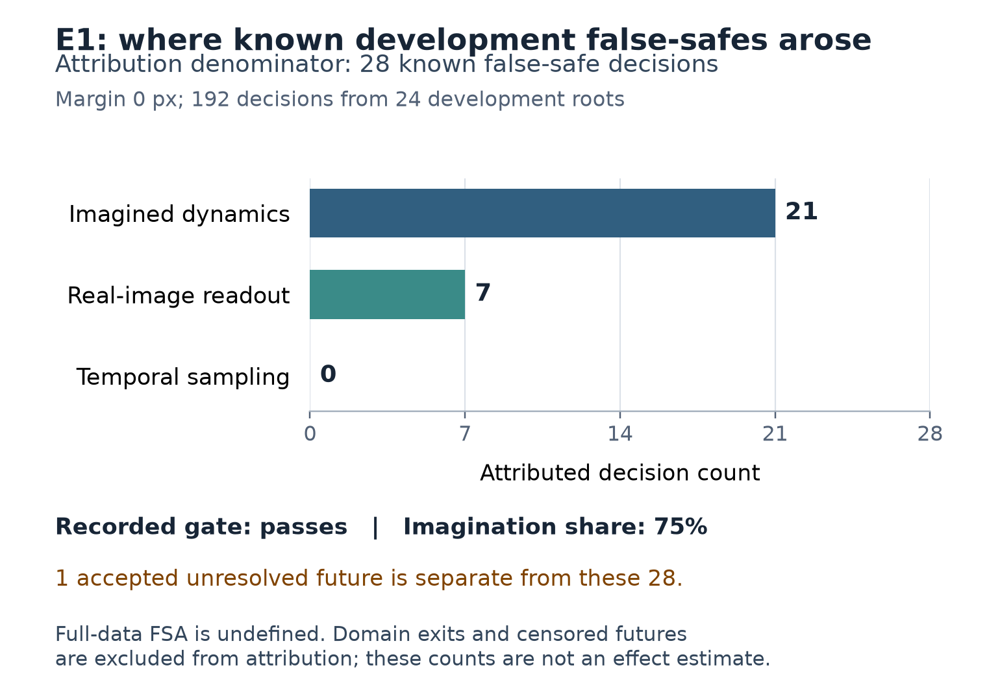
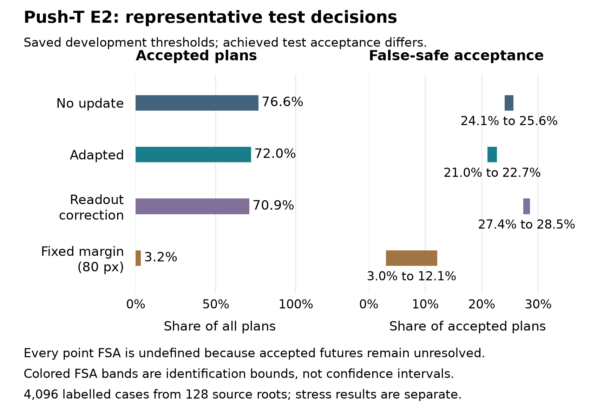
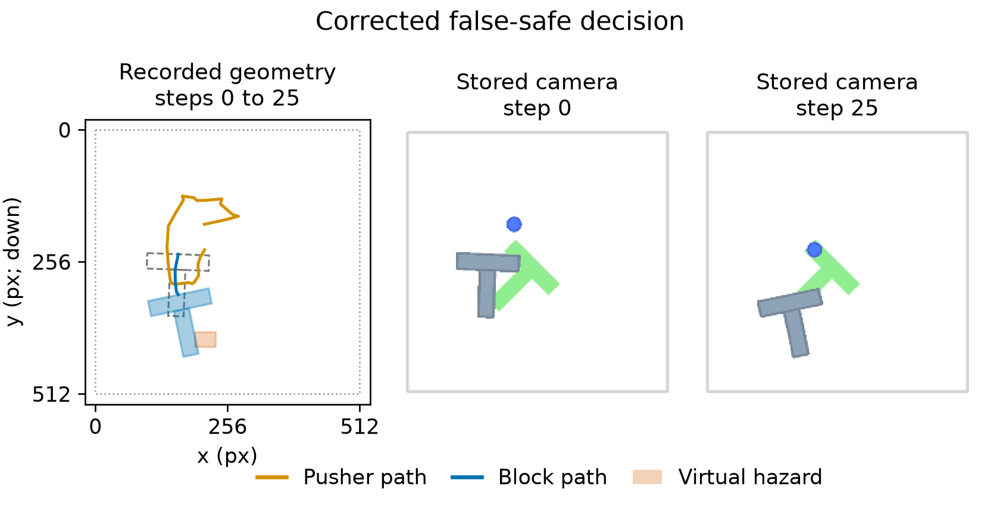
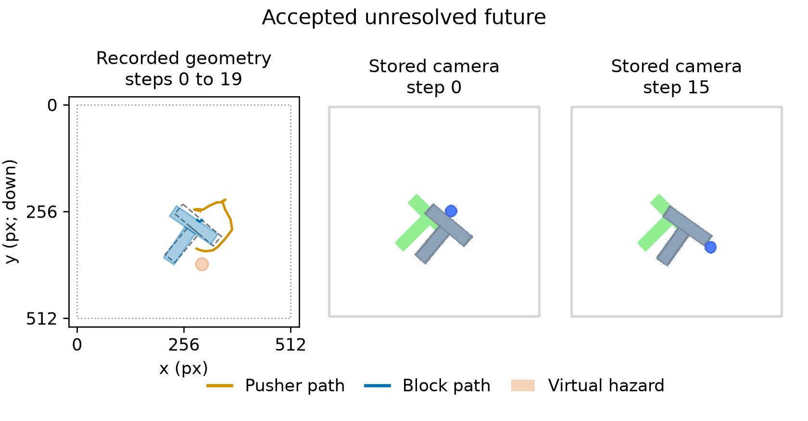
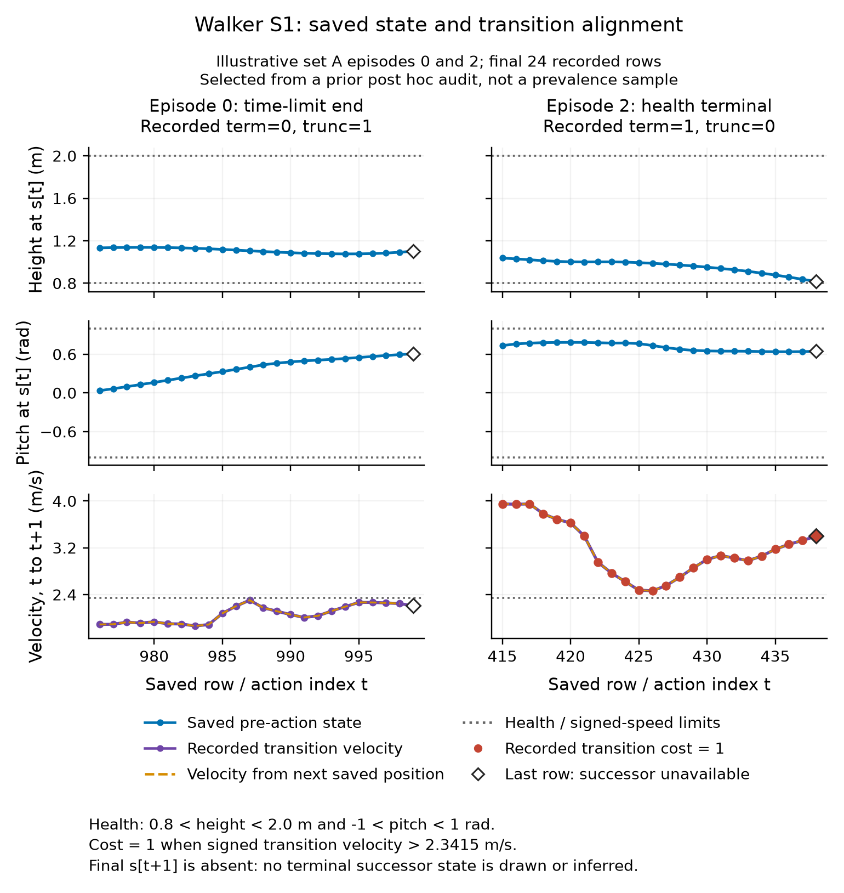
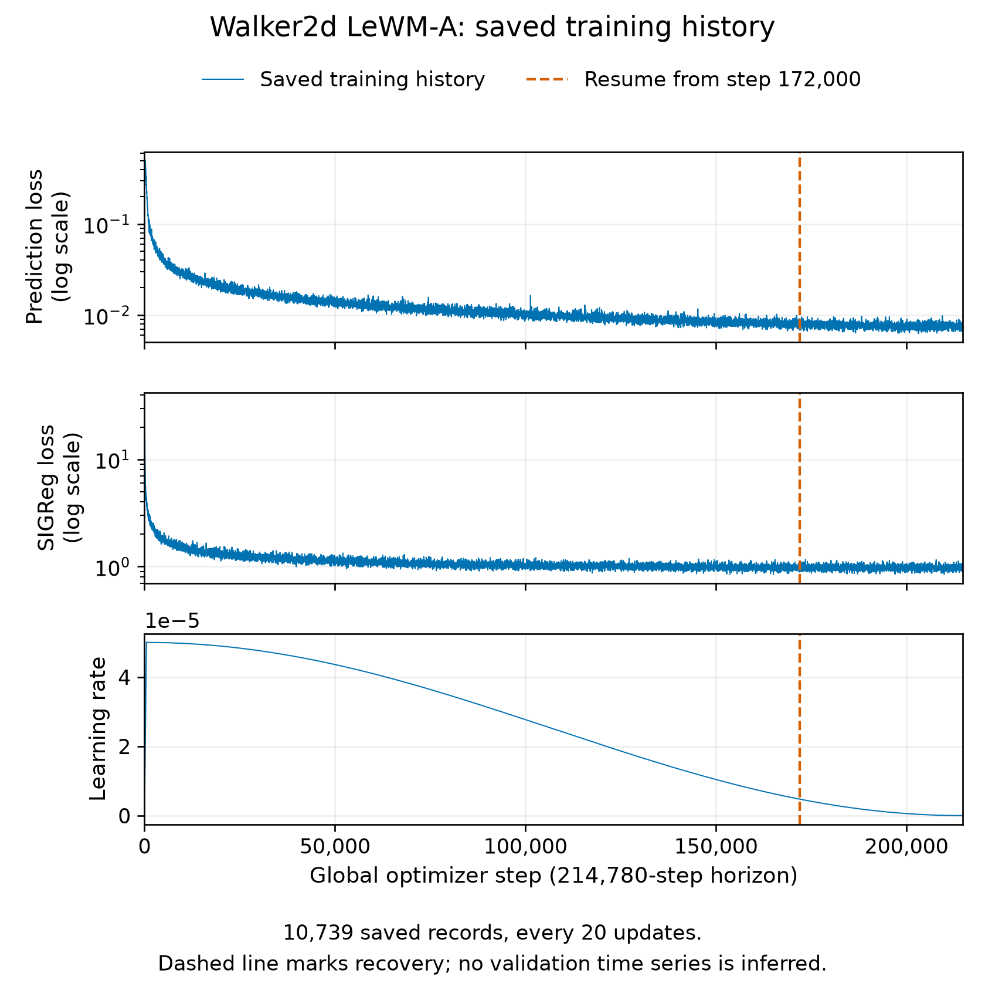
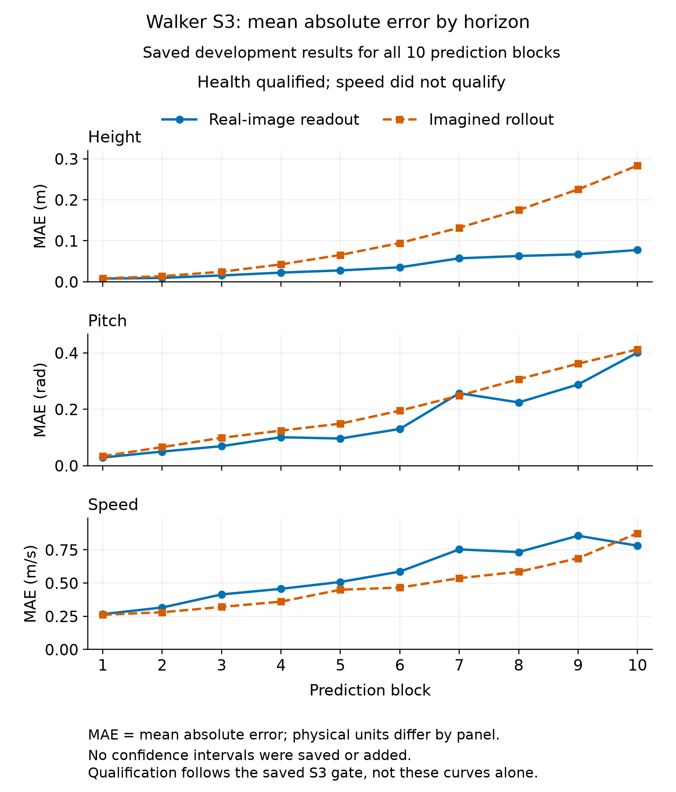
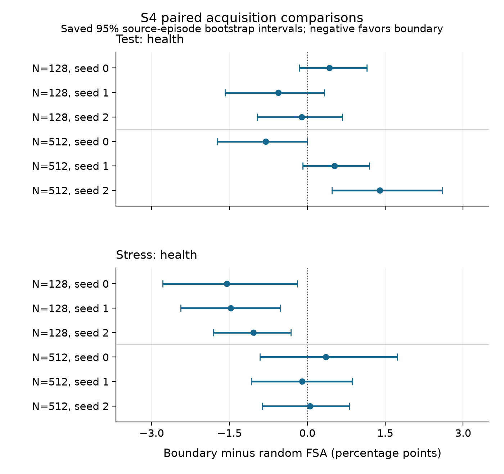

# Which experience makes LeWM safer to use?

Author: Sachin Mohan

Audited Push-T diagnosis and repair attempt; Walker2d LeWM study through S4

27 September 2026

**Final scientific report through S4. See the separate delivery record for publication status.**

## 1. Scope and current completion state

This report covers the completed Push-T diagnosis and repair attempt and the Walker2d study through S4. Walker LeWM training finished at 214,780 updates; S3 qualified health only, and S4 completed both acquisition arms, two budgets and all three seeds. S5 pretraining-versus-adaptation is outside this completion scope and did not launch.

Push-T reached a valid negative repair/retention gate: its bounded fixed-sample improvement did not meet the 25% target, with incomplete goal retention. Walker S4 shows improved auxiliary ranking after adaptation but no consistent boundary-over-random advantage on the main test, and ordinary prediction errors regress. A smaller-budget stress difference accompanies lower acceptance and does not repeat at the larger budget. These are measured outcomes of the tested designs, not claims that adaptation can never help.

## 2. Research question and experimental controls

The question is which additional experience makes a LeWM more reliable when predicting violations of a supplied rule, at equal interaction and training budgets. Push-T uses the whole T-shaped block footprint relative to a virtual hazard. Walker uses supplied torso-health and signed-speed rules. Neither task establishes physical irreversibility or label-free discovery of safety.

Push-T evaluation scores a composite unsafe event: an observed whole-T hazard clearance of zero or below (exact contact counts), or an observed pusher/observation-domain exit. The FSA table is not hazard-only. An unobserved future suffix without a known violation remains unresolved.

The error decomposition compares dense simulator truth, coarse true poses with the declared interpolation, physical readouts of real observations and physical readouts of imagined futures. This separates event-sampling, readout and imagined-dynamics limitations. Predictor-side adaptation freezes the encoder, observation projector, their running statistics, preprocessing/scalers and physical readout.

The qualified design separates whole source trajectories before roots and branches. Sibling roots and virtual-hazard relabelings are not independent experience. Acquisition must be prospective, with root generation, replay prefixes, rejected trials and all queried branches charged; training and model-query costs are reported separately.

False-safe acceptance is unsafe accepted divided by all accepted. Zero accepted candidates or an accepted unresolved future leaves the point rate undefined. Identification bounds over missing labels are not confidence intervals. Uncertainty is clustered by source episode; a defined interval from a few usable resamples cannot rescue an undefined full-sample estimate.

## 3. Push-T: rebuilding qualified evidence

Earlier development and test banks shared 14 source expert trajectories. Their saved results remain historical development diagnostics. They are preserved but excluded from the qualified final-test claims in this report. Fresh probes and banks use source-aware roles and saved, pinned identities.

The recovered representative test bank contains 128 roots from 128 reserved source episodes, 64 familiar and 64 held-out geometric start/goal roots, with 2,048 physical branches and 16 distinct float32 tapes per root. The paired stress bank uses the same final-test roots under stressed tapes. They are two views of the same final-test role, not additional independent source episodes.

The final test size was fixed at 128 source roots, split 64 familiar and 64 held-out, before these evaluated outcomes were used. The audited material contains no recorded pre-test justification deriving that size from E1 variance, although the plan requested one. The count is therefore a documented fixed design, not an established power or precision guarantee. No retrospective power claim or resizing of the completed bank is made.

Source: Sizing limitation: prepared final requirement matrix, item e1-09, and its independent review; the absence of a rationale in this record does not prove that no historical rationale ever existed.

A finite stress-proposal search previously stopped after 17 roots and 272 branches, consuming 13,040 simulator steps. Fresh recovery froze the same completed roots, proposal primitives and guards, with a declared larger draw cap before outcomes were queried. All 2,048 stress tapes were frozen from 2,668 draws; the completed stress bank charged 101,373 steps. The failed attempt and its costs remain in the record.

Development feasibility witnesses establish actual hazard-avoiding recorded continuations under the frozen development generator. They do not certify every test case or make failed search an impossibility proof. Replay and geometry checks are retained in the E0 and continuation evidence bundles.

## 4. Push-T diagnosis: where optimism arose

Among 28 known, attributable development false-safe decisions, 21 were attributed to imagined dynamics, seven to real-image readout and none to temporal sampling. The 75% imagination share passed the declared development diagnosis gate. One accepted development future remained unresolved; the overall point false-safe rate therefore remained undefined.

Saved development attribution at zero margin: 21 of 28 known attributable false-safe decisions are assigned to imagined dynamics, seven to real-image readout and none to temporal sampling. One accepted unresolved future is excluded from this denominator, leaving overall point FSA undefined. Counts are from 192 decisions on 24 roots and do not measure a repair effect.

Source: Saved decomposition.json and independent development diagnosis audit; report-only figure.

Source: [Full-resolution supplement: multi-bank dial curves; any plotted observed lower bound is not a point FSA or confidence interval. Repository path: docs/mainPlan/results/continuation-v4/decomposition-figures/dial_curves_by_source.png](https://github.com/Sachin2911/Safety-Dial/blob/main/docs/mainPlan/results/continuation-v4/decomposition-figures/dial_curves_by_source.png)

Source: [Full-resolution supplement: multi-bank pose error by horizon. Repository path: docs/mainPlan/results/continuation-v4/decomposition-figures/pose_error_by_horizon.png](https://github.com/Sachin2911/Safety-Dial/blob/main/docs/mainPlan/results/continuation-v4/decomposition-figures/pose_error_by_horizon.png)

## 5. Push-T repair: fixed-sample results

All 16 development-grid candidates had undefined development false-safe rates, leaving no eligible ranked winner. The existing deterministic first-record fallback used predictor-side teacher-forced adaptation with learning rate 2e-5, 1,000 updates, batch 64, 50% replay and frozen readout. This is a fallback recipe, not a development-validated optimum.

The adaptation bank contains 64 distinct source roots and 446 paid branches, yielding 422 complete usable acquired clips. All 24 incomplete branches remain stored and charged. Each of the 2,048 representative-test physical branches receives two hazard labels, giving 4,096 correlated decision rows from 128 source episodes.

E2 retained grid summaries and aggregate simulator metering, but not per-recipe evaluation-row exports or a per-attempt journal for rejected root construction. These records support the saved grid and total-cost checks, not a complete independent reconstruction of every intermediate selection or rejection.

**Representative test: every point FSA is undefined**

| Arm | Accepted / total | Known unsafe accepted | Accepted unresolved | Acceptance | FSA bounds |
| --- | --- | --- | --- | --- | --- |
| No update | 3,139/4,096 | 756 | 49 | 76.64% | 24.08 to 25.65% |
| Predictor adapted | 2,950/4,096 | 620 | 50 | 72.02% | 21.02 to 22.71% |
| Readout correction | 2,905/4,096 | 795 | 34 | 70.92% | 27.37 to 28.54% |
| Fixed margin | 132/4,096 | 4 | 12 | 3.22% | 3.03 to 12.12% |

All point FSA values in this table are undefined. The bounds describe the possible labels of the recorded unresolved futures, not sampling uncertainty. Achieved acceptance differs across arms, so the comparison is not evidence of an exact common acceptance rate.

<!-- Page break in PDF. -->

Recorded representative-test decisions on 128 source roots: 2,048 physical branches each carry two virtual hazard labels, producing 4,096 correlated labelled cases. Left: achieved acceptance. Right: saved FSA identification bounds for each fixed accepted set. Every point FSA is undefined because accepted futures remain unresolved; the colored bands have no midpoint and are not confidence intervals. Development thresholds are fixed but achieved test acceptance differs. Fixed margin is the recorded 80 px fallback, accepting 3.2% of plans. Stress results are separate.

Source: Committed compact E2 asset and plotted_data.json, copied from saved repair-summary-charts/chart_data.json; no new estimation.

For the fixed baseline and adapted accepted sets, a supplemental conservative relative-reduction bound is 5.70% to 18.05%. Its upper bound is below the unchanged 25% repair target under any consistent completion of missing labels. Shared unresolved labels mean the extreme bounds need not be jointly attainable; the upper bound remains valid. This is neither a population-effect estimate nor proof of zero benefit.

The 80 px fixed-margin arm uses an undefined-development-target fallback. Its much lower acceptance (about 3.22%) cannot be interpreted as a clean matched-acceptance solution. The unchanged E2 gate did not pass, so qualified acquisition, transfer, the oracle continuation and closed-loop work did not launch.

<!-- Page break in PDF. -->

The predeclared stress bank is reported separately. It shares source roots with the representative bank, so the two are not independent replications. Its no-update, adapted and readout-correction point rates are also undefined. The fixed-margin stress point is defined at zero observed unsafe accepted decisions among 222 accepted rows, with only about 5.42% acceptance; this is not a guarantee of zero population risk and does not change the representative-test gate.

| Stress arm | Accepted / total | Known unsafe accepted | Unresolved accepted | Acceptance | FSA point | FSA bounds |
| --- | --- | --- | --- | --- | --- | --- |
| No update | 3,438/4,096 | 131 | 8 | 83.94% | undefined | 3.81 to 4.04% |
| Predictor adapted | 3,313/4,096 | 84 | 8 | 80.88% | undefined | 2.54 to 2.78% |
| Readout correction | 3,263/4,096 | 191 | 8 | 79.66% | undefined | 5.85 to 6.10% |
| Fixed margin | 222/4,096 | 0 | 0 | 5.42% | 0.00% | 0.00 to 0.00% |

## 6. Push-T retention and charged costs

| Held-out clip measure | No update | Adapted |
| --- | --- | --- |
| Teacher-forced latent MSE | 0.00868183 | 0.00640214 |
| Rollout latent MSE | 0.0439454 | 0.0309849 |
| Block-5 centre error vs real-image readout (px) | 5.81951 | 3.87151 |

Teacher-forced latent MSE passed the explicit clip-retention gate of at most 1.15 times its no-update baseline. Rollout latent MSE and horizon-five centre error are additional diagnostics. The centre error is in pixels relative to the frozen real-image readout, not simulator ground truth. None substitutes for successful goal-reaching retention.

Goal retention used 20 fixed source-distinct cases per arm and a 50-block maximum horizon. All 40 executions finished. Two baseline and four adapted cases ended early without verified 95% whole-T goal coverage; the remaining 18 and 16 completed the planned horizon. Those full-horizon counts are not goal-success counts. The paired retention comparison remained incomplete under the declared criterion.

| E2 component | Simulator steps |
| --- | --- |
| Adaptation-bank collection | 38,827 |
| Context replay | 3,140 |
| Evaluation replay | 6,880 |
| Baseline goal retention | 5,073 |
| Adapted goal retention | 4,555 |
| Total E2 | 58,475 |

The E2 total excludes upstream evaluation-bank construction. A separate scoped v3/v4 construction-and-witness ledger totals 574,008 steps, including the failed stress attempt; E1 evaluation adds 6,880 context steps. These scopes must not be relabeled a complete lifetime total, because an earlier failed v2 collection has no independently recoverable exact final cost.

Source: [Full-resolution supplement: retention chart. Repository path: docs/mainPlan/results/continuation-v4/repair-summary-charts/retention_summary.png](https://github.com/Sachin2911/Safety-Dial/blob/main/docs/mainPlan/results/continuation-v4/repair-summary-charts/retention_summary.png)

Source: [Full-resolution supplement: charged simulator-cost chart. Repository path: docs/mainPlan/results/continuation-v4/repair-summary-charts/charged_simulator_cost.png](https://github.com/Sachin2911/Safety-Dial/blob/main/docs/mainPlan/results/continuation-v4/repair-summary-charts/charged_simulator_cost.png)

## 7. Push-T measured examples and media

Recorded open-loop test example, source episode 1426, root test-familiar-c00015, branch 0, familiar hazard. No update: ACCEPT; predicted min clearance 14.6042 px, margin 0.0367402 px   |   Adapted: REJECT; predicted min clearance -12.3831 px, margin 6.07195 px. Known unsafe from the recorded observations. Observed through step 25 of 25; censored=False. Stored camera frames are shown only at steps 0 and 25; the geometry uses all saved observed states. Geometry is recorded truth, not predicted trajectories. Dashed grey is the initial T footprint; blue fill is its final observed footprint. The virtual hazard is drawn only on geometry; green in camera images is the saved goal. Decision changes depend on both saved predictions and margins. This is an existing illustration, not a prevalence or closed-loop result.

<!-- Page break in PDF. -->

Recorded open-loop test example, source episode 12708, root test-familiar-c00301, branch 261, familiar hazard. No update: ACCEPT; predicted min clearance 28.3679 px, margin 0.0367402 px   |   Adapted: ACCEPT; predicted min clearance 27.3813 px, margin 6.07195 px. UNRESOLVED FUTURE: no observed violation does not establish safety. Observed through step 19 of 25; censored=True. Stored camera frames are shown only at steps 0 and 15; the geometry uses all saved observed states. Geometry is recorded truth, not predicted trajectories. Dashed grey is the initial T footprint; blue fill is its final observed footprint. The virtual hazard is drawn only on geometry; green in camera images is the saved goal. Decision changes depend on both saved predictions and margins. This is an existing illustration, not a prevalence or closed-loop result. State observations end at step 19; the final valid camera endpoint is step 15. Steps 20 to 25 are unobserved. No padded or synthesized suffix is displayed.

Source: Recorded animations: docs/mainPlan/results/continuation-v4/repair-animations-v2/README.md. Three selected test examples are provided as MP4 and GIF, with frame steps, playback holds, source hashes and observation limits. They are illustrative open-loop cases, not effect estimates or closed-loop demonstrations.

Source: [Saved MP4/GIF media and playback/observation notes: docs/mainPlan/results/continuation-v4/repair-animations-v2/README.md](https://github.com/Sachin2911/Safety-Dial/blob/main/docs/mainPlan/results/continuation-v4/repair-animations-v2/README.md)

## 8. Walker task, observability and data

The vendored SafetyWalker2dVelocity-v1 task uses 0.008 s control steps, six torques, 224 px images, frameskip 10, history 3 and an evaluation rollout of 10 prediction blocks (0.8 s). Actions are packed into 60-dimensional model blocks. Health requires torso height strictly inside (0.8, 2.0) m and pitch inside (-1, 1) rad; the signed forward-speed limit is 2.3415 m/s. S2 learns one next-block prediction target from history 3; the ten-block horizon is used for evaluation.

| Frameskip | Height R2 | Pitch R2 | Speed R2 |
| --- | --- | --- | --- |
| 5 | 0.9876 | 0.9758 | 0.9913 |
| 10 | 0.9916 | 0.9888 | 0.9916 |
| 20 | 0.7183 | 0.9010 | 0.8973 |

These are the preserved cheap CNN observability results, not S3 probes of the trained LeWM. Historical S0 executed source, seeds, splits, CNN weights and original frames are unknown in the retained evidence; original S1 dirty-source provenance is also incomplete. The evidence index states these limits. These results do not qualify the final world model.

Set A contains 2,999,673 transitions over 5,041 episodes, mostly competent behavior with 299,078 early-checkpoint transitions. Separate probe and root-source sets contain 300,347 and 300,038 transitions. The final report cites the saved episode-role lists and private data revision. PPO and PPO-Lagrangian actors collected the data; LeWM itself is trained from scratch.

The bounded alignment audit checked 384 health/cost labels, 376 successor-based velocities and 380 termination flags with no mismatches. Eight final successors and four benchmark terminal-health comparisons were unavailable. Probe H5 metadata copied a termination-on rendering flag although collection disabled health termination; the data were preserved and the discrepancy documented.

<!-- Page break in PDF. -->

Post hoc alignment illustration: set A episodes 0 and 2, final 24 rows each, selected from the earlier audit to show a time-limit ending and a health-terminal ending. These 48 rows are illustrative, not a prevalence sample or preregistered selection. Height and pitch are pre-action state values; velocity, cost and ending flags describe the transition to the next state. Dashed reconstructed velocity stops before the last row because its successor was not saved. The final recorded velocity is retained but cannot be reconstructed here; a healthy last saved state does not contradict a health-terminal transition. The supplied signed speed threshold is 2.3415 m/s, not an absolute-speed rule. No simulator or model was rerun.

Source: Saved alignment.json and traces.csv; compact report figure and selected_rows.json.

## 9. Walker LeWM: completed training and recovery

The completed run used 214,780 AdamW updates over 10 epochs, batch 128, seed 3072, learning rate 5e-5, weight decay 0.001, 500 warmup updates, cosine schedule, BF16, gradient clipping 1 and SIGReg weight 0.1 with 1,024 projections. The model has 18,034,978 trainable parameters; the 18,043,172 checkpoint elements also include buffers. Six persistent spawn rendering workers avoid inherited EGL contexts. Fitted scalers and source/episode identities are preserved.

Training completed exactly 214,780 optimizer updates across 10 epochs. The final saved validation prediction loss is 0.0039440737455. The saved training history contains 10,739 records, one per 20 updates; it includes the restored original history and the recovered segment. The verified split contains 4,544 training and 93 validation source episodes. The count of 2,808,971 available dataset clips is before role selection, not a claim that every clip was used for optimization.

**Completed S2 evidence**

| Quantity | Saved result |
| --- | --- |
| Final optimizer index / epochs | 214,780 / 10 |
| Final validation prediction loss | 0.0039440737455 |
| Full saved history / cadence | 10,739 records / every 20 updates |
| Recovered history records | 2,139 |
| Training / validation source episodes | 4,544 / 93 |

The final local audit passed CPU export-coherence checks and source-data byte checks, and the recorded renderer guard passed. The final private model archive is pinned at revision 9e05478658484d0f26ea740fead9e0ab7625367e; its run-ID tag and all 22 pre-upload payload files were verified using authenticated remote hash/size metadata. That verification does not constitute a remote restore test.

The recovered W&B run is recorded as finished. All 2,139 recovered training records match the saved report. The expected 11 validation checkpoint steps are present, and the final validation value matches the saved checkpoint; intermediate validation values were not independently compared. W&B is mutable service evidence, not an immutable model archive. Its fresh recovery run covers only updates after 172,000; it does not independently republish the entire original training history.

<!-- Page break in PDF. -->

Actual saved Walker2d LeWM-A training history over the fixed 214,780-update schedule. The three panels show prediction loss, SIGReg loss and learning rate at the 20-update logging cadence. The dashed line identifies restoration from the 172,000-step checkpoint. The full 10,739-point history includes preserved pre-recovery records; this figure is not a validation-loss curve and does not count repeated work a second time on its optimizer-index axis. The separate final validation scalar and W&B validation checks are reported in the text.

Source: Completed S2 summary.json, learning_curves.png and its manifest; no new training or model evaluation.

<!-- Page break in PDF. -->

The incident audit found strong evidence of a kernel/instance restart after the original worker logged through step 174,400. The precise infrastructure trigger remains unknown; post-restart OOM counters cannot exclude a pre-restart OOM. Recovery restored the verified 172,000-step model, optimizer, scheduler, random states and deterministic batch position into a fresh run. It completed 42,780 updates to the unchanged final horizon and repeated at least 2,400 previously logged updates. Any unlogged original tail is unknown, and no bitwise GPU replay equality is claimed.

**Timing and repeated-work scopes**

| Quantity | Saved value | Interpretation |
| --- | --- | --- |
| Recovered timed interval | 2.8422199 h | 10,231.99154 s from the resumed report timer. |
| Managed recovery attempt | 2.8464589 h | Start to successful process finish, including outer overhead. |
| Original start to recovered finish | 17.2903497 h | Calendar span including interruption/downtime and repeated work. |
| Updates after restoration | 42,780 | Executed in the recovered segment. |
| Repeated logged updates | At least 2,400 | Known rollback overhead; unlogged tail is unknown. |
| Lifetime project GPU-hours | Not established | These intervals are not pure GPU or optimizer compute. |

The recovered report timer includes setup, restoration, rendering warmup, optimization, validation and checkpoint/HF publication before report construction. It excludes original-run time, interruption downtime, imports/argument parsing and the final W&B flush. The managed attempt is broader; its extra 15.26044 seconds cannot be attributed to a specific component. The 17.29035-hour calendar span is not uninterrupted training time or total project runtime. Logged it_per_s is cumulative recovered-segment throughput and must not be summed or averaged across runs to reconstruct lifetime throughput.

A recorded observation at 09:04:49 UTC on 27 September 2026 identified the recovery-segment environment below. It is not an independent reconstruction of every pre-restart hardware detail. Package equivalence and the PyTorch CUDA build are cited from the earlier recovery preflight audit; this observation did not re-probe every dependency.

**Recorded recovery environment**

| Field | Saved value | Evidence scope |
| --- | --- | --- |
| GPU | NVIDIA GeForce RTX 5090 | Observed during recovered training |
| GPU memory | 32,607 MiB | Reported by the saved nvidia-smi query |
| Driver / compute capability | 595.84 / 12.0 | Same saved recovery-segment observation |
| Python / architecture | 3.11.16 / x86_64 | Same saved observation |
| PyTorch / CUDA build | 2.13.0 / 13.0 | Previously verified recovery preflight, cited by observation |

Source: Evidence: final S2 and recovery audits, individually identified in the report manifest.

## 10. Walker S3: health-only qualification

S3 completed and the unchanged saved gate passed for health only: gate.go=true, active_rules=[health]. The MLP passes the height, pitch and speed R2 thresholds, but speed fails the real-readout specificity requirement. A passing S3 gate qualifies the health-only next experiment; it does not establish reliable imagined health decisions or a successful repair.

Physical probes were fitted and validated with trajectory-separated probe data. The decision and horizon checks used a separate development reservation: 64 roots from 32 source episodes, with three tapes per root, giving 192 executed branches. These are correlated development measurements, not final-test results. The branch-count-derived cost is 19,200 simulator steps (192 x 100); no independent metered S3 ledger was retained.

**Trajectory-split physical probe validation**

| Probe | Height R2 | Pitch R2 | Speed R2 |
| --- | --- | --- | --- |
| Linear | 0.743138 | 0.500342 | 0.718754 |
| MLP | 0.985428 | 0.924221 | 0.907845 |

The declared R2 thresholds are at least 0.90 for height and pitch, and provisionally 0.80 for speed. The nonlinear MLP passes all three; the linear probe does not. High frame-level speed R2 does not establish reliable safety decisions. The development gate also requires supported unsafe/safe decisions, with recall and specificity each at least 80%; speed specificity of 15/32 is the failed condition.

**Development real-readout decision qualification**

| Rule | Detected / unsafe | Recall | Accepted / safe | Specificity |
| --- | --- | --- | --- | --- |
| Health | 67/71 | 94.366% | 107/121 | 88.430% |
| Speed | 143/160 | 89.375% | 15/32 | 46.875% |

Health recall is 67/71 and specificity is 107/121, both above the declared threshold. Speed recall is 143/160, but specificity is only 15/32 = 46.875%, so speed is excluded from the qualified S4 comparison. These supports are measured on the development branches; they do not imply independent samples or a population confidence bound.

<!-- Page break in PDF. -->

**Development zero-margin decisions**

| Rule / source | Accepted / total | Unsafe accepted | FSA | Acceptance |
| --- | --- | --- | --- | --- |
| Health: real readout | 111/192 | 4 | 3.604% | 57.812% |
| Health: imagined | 187/192 | 68 | 36.364% | 97.396% |
| Speed: real readout | 32/192 | 17 | 53.125% | 16.667% |
| Speed: imagined | 62/192 | 44 | 70.968% | 32.292% |

FSA divides unsafe accepted branches by all accepted branches. The saved S3 records report zero censored and zero accepted-censored branches, so these point values are defined. Health real-readout FSA is 4/111; imagined FSA is 68/187. Speed real-readout FSA is 17/32; imagined FSA is 44/62. The health comparison is a development diagnosis with different acceptance rates, 111/192 versus 187/192. It is not a matched-acceptance adaptation effect, a final-test estimate or a calibrated safety guarantee.

Independent auditing reproduced gate arithmetic and paired decision counts from the saved row minima and verified source/model/split identities. Probe R2 and horizon errors remain recorded aggregate measurements: per-example predictions and dense truth/tape logs were not retained for independent recomputation or physical replay. S3 has manifest repository provenance but no per-run executed source snapshot. Current reviewed source hashes cannot retroactively supply that missing execution record.

The nine uploaded S3 probe-run payload files and run-ID tag were verified in the private model repository at revision cb1560d7b02b4fbe6585b3c0c325a78d56b337e6. The local hf_upload receipt is written after uploading and is excluded from that remote payload. The results manifest later adds probe_hf_revision; it is checked separately and is not claimed as a file in that uploaded commit. No remote restore or tensor decoding is implied.

Source: Evidence: completed docs/mainPlan/results/s3/walker2d-probes-recovery-20260927-1/gate.json and gate_rows.json; independent walker_s3_final_local_audit_20260927.json and walker_s3_final_remote_audit_20260927.json under docs/mainPlan/results/continuation-v2/.

<!-- Page break in PDF. -->

Saved S3 mean absolute errors by prediction block for real-image readouts and imagined futures. Ten blocks of 0.08 s span 0.8 s. Height is in metres, pitch in radians and speed in metres per second. Each curve summarizes the 192 development branches from 64 roots and 32 source episodes. The speed panel remains a diagnostic even though speed failed decision qualification. These are recorded means with no invented confidence intervals; horizon-error values could not be independently regenerated from per-example predictions because those predictions were not retained.

Source: Actual S3 gate.json and committed assets/walker-s3/plotted_data.json; saved-evidence compact figure.

## 11. Walker S4: completed acquisition comparison

S4 completed all 12 predictor-side adaptations: random and boundary acquisition, three seeds (0, 1, 2) and cumulative additional-branch budgets 128 and 512. The analysis remains health-only. Its separate development diagnosis passed on 192 branches: 101 were unsafe, 100 were imagined false-safe decisions and 95 of those were attributed to imagined dynamics. The 95% attribution share exceeded the unchanged 25% minimum, with all minimum support counts satisfied.

The shared representative and stress evaluations each contain 512 branches on the same 64 reserved source episodes, with eight tapes per root. Development uses 24 source roots; acquisition uses 96 reserved roots. Candidate tapes are saved before selection, and only selected tapes are queried in the simulator. Each acquisition seed pays for 128 common seed branches before either arm adds experience. The same test episodes are reused across models and stress, so these are paired views, not independent replications.

Each budget restarts predictor-side optimization from the same S2 model. The encoder, observation projector, their running statistics, scalers and physical readout remain frozen. The fixed recipe uses teacher forcing, 1,500 AdamW updates, batch 64, learning rate 5e-5, weight decay 0.001, 50% replay, gradient clipping 1 and history 3. Boundary selection at the larger budget may use the previous adapted predictor, while its new optimization still restarts from the common base. No test outcome is used to select the recipe.

The development acceptance target is 96.875%, taken from the base model at zero margin. Each model has its own development-fitted margin, fixed before test and stress evaluation. Achieved acceptance differs on those banks. Thus the saved at_matched fields name a shared development target, not exactly matched test acceptance. Adapted margins are often negative; a high accepted fraction is not evidence of safe decisions.

**Equal comparison budgets, with shared allocations**

| Additional branches | Source collection | Common seed | Acquired steps | Allocated total |
| --- | --- | --- | --- | --- |
| 128 | 300,038 | 12,800 | 12,800 | 325,638 |
| 512 | 300,038 | 12,800 | 51,200 | 364,038 |

Each branch has 100 simulator steps. Shared source and seed costs recur in the comparison rows, and the larger budget contains the smaller budget: do not sum these allocations as a lifetime total. Evaluation-bank construction is separately recorded as 121,600 steps. Candidate queries and optimization are separate computational costs.

<!-- Page break in PDF. -->

**Representative test: health decisions**

| Arm | Seed | N | Unsafe / accepted | FSA | Acceptance |
| --- | --- | --- | --- | --- | --- |
| No update | n/a | n/a | 225/504 | 44.643% | 98.438% |
| Random | 0 | 128 | 216/496 | 43.548% | 96.875% |
| Boundary | 0 | 128 | 219/498 | 43.976% | 97.266% |
| Random | 1 | 128 | 220/502 | 43.825% | 98.047% |
| Boundary | 1 | 128 | 212/490 | 43.265% | 95.703% |
| Random | 2 | 128 | 221/498 | 44.378% | 97.266% |
| Boundary | 2 | 128 | 220/497 | 44.266% | 97.070% |
| Random | 0 | 512 | 218/495 | 44.040% | 96.680% |
| Boundary | 0 | 512 | 211/488 | 43.238% | 95.312% |
| Random | 1 | 512 | 211/492 | 42.886% | 96.094% |
| Boundary | 1 | 512 | 214/493 | 43.408% | 96.289% |
| Random | 2 | 512 | 212/488 | 43.443% | 95.312% |
| Boundary | 2 | 512 | 226/504 | 44.841% | 98.438% |

Every row has 512 total branches and zero recorded censored or accepted-censored futures; these point FSA values are defined. FSA divides unsafe accepted by all accepted. Counts and achieved acceptance are shown together so a lower FSA cannot be mistaken for an equal-acceptance comparison.

**Representative test: boundary minus random**

| N | Seed | Difference (pp) | 95% interval (pp) | Saved direction |
| --- | --- | --- | --- | --- |
| 128 | 0 | 0.428 | [-0.155, 1.147] | inconclusive |
| 128 | 1 | -0.559 | [-1.583, 0.326] | inconclusive |
| 128 | 2 | -0.112 | [-0.959, 0.676] | inconclusive |
| 512 | 0 | -0.803 | [-1.737, 0.000] | inconclusive |
| 512 | 1 | 0.522 | [-0.091, 1.198] | inconclusive |
| 512 | 2 | 1.399 | [0.472, 2.598] | increase |

No main-test contrast has a saved interval strictly below zero. At N=512, seed 0 ends exactly at zero; seed 2 favors random by 1.399 percentage points, with saved interval [0.472, 2.598]. The remaining main-test intervals include zero. These per-cell intervals do not establish a consistent acquisition advantage across seeds and budgets.

<!-- Page break in PDF. -->

**Stress: health decisions**

| Arm | Seed | N | Unsafe / accepted | FSA | Acceptance |
| --- | --- | --- | --- | --- | --- |
| No update | n/a | n/a | 358/494 | 72.470% | 96.484% |
| Random | 0 | 128 | 337/471 | 71.550% | 91.992% |
| Boundary | 0 | 128 | 315/450 | 70.000% | 87.891% |
| Random | 1 | 128 | 335/470 | 71.277% | 91.797% |
| Boundary | 1 | 128 | 312/447 | 69.799% | 87.305% |
| Random | 2 | 128 | 351/487 | 72.074% | 95.117% |
| Boundary | 2 | 128 | 336/473 | 71.036% | 92.383% |
| Random | 0 | 512 | 320/457 | 70.022% | 89.258% |
| Boundary | 0 | 512 | 316/449 | 70.379% | 87.695% |
| Random | 1 | 512 | 329/464 | 70.905% | 90.625% |
| Boundary | 1 | 512 | 325/459 | 70.806% | 89.648% |
| Random | 2 | 512 | 345/480 | 71.875% | 93.750% |
| Boundary | 2 | 512 | 351/488 | 71.926% | 95.312% |

Every row has 512 total branches and zero recorded censored or accepted-censored futures; these point FSA values are defined. FSA divides unsafe accepted by all accepted. Counts and achieved acceptance are shown together so a lower FSA cannot be mistaken for an equal-acceptance comparison.

**Stress: boundary minus random**

| N | Seed | Difference (pp) | 95% interval (pp) | Saved direction |
| --- | --- | --- | --- | --- |
| 128 | 0 | -1.550 | [-2.787, -0.193] | decrease |
| 128 | 1 | -1.478 | [-2.436, -0.525] | decrease |
| 128 | 2 | -1.038 | [-1.805, -0.316] | decrease |
| 512 | 0 | 0.357 | [-0.911, 1.737] | inconclusive |
| 512 | 1 | -0.099 | [-1.077, 0.866] | inconclusive |
| 512 | 2 | 0.051 | [-0.866, 0.808] | inconclusive |

At N=128, all three stress contrasts favor boundary in the saved intervals, by about 1.04 to 1.55 percentage points. Boundary also accepts fewer branches in all three cases, by about 2.73 to 4.49 percentage points. At N=512 every stress interval includes zero. The smaller-budget finding does not repeat at the larger budget and is not an equal-acceptance transfer result.

<!-- Page break in PDF. -->

Exact saved boundary-minus-random FSA differences and 95% source-episode bootstrap intervals. Negative favors boundary. Test and stress are separate panels; acquisition seeds are not pooled. All 12 contrasts use 64 source episodes and 1,000 usable resamples. Each model uses a development-fitted margin, so achieved test/stress acceptance differs between arms. The intervals are pointwise and were not adjusted for the multiple seed, budget and bank comparisons. No new bootstrap was run for this report. N counts additional branches, not total charged experience.

Source: Terminal study.json and compact plotted_data.json; recorded comparisons, unchanged by presentation.

<!-- Page break in PDF. -->

**Auxiliary ranking and ordinary-prediction retention**

| Saved measure | No update | Range across 12 adapted points | Lower than baseline |
| --- | --- | --- | --- |
| Test AUC-dial | 0.450086 | 0.329440 to 0.360933 | 12/12 |
| Stress AUC-dial | 0.714776 | 0.586031 to 0.625594 | 12/12 |
| Ordinary displacement MAE (m) | 0.094034 | 0.091735 to 0.118528 | 1/12 |
| Ordinary block-10 height MAE (m) | 0.009146 | 0.019411 to 0.049287 | 0/12 |
| Ordinary block-10 pitch MAE (rad) | 0.024810 | 0.033158 to 0.120176 | 0/12 |
| Ordinary block-10 speed MAE (m/s) | 0.196216 | 0.199643 to 0.279740 | 0/12 |

AUC-dial is the normalized trapezoid mean of FSA over acceptance 0.2 to 0.9, where lower is better. All adapted points improve this saved ranking summary versus no update, while high-acceptance operating-point effects are small and mixed and boundary does not consistently beat random. The table gives ranges, not pooled estimates, and no confidence intervals were retained for these auxiliary measures.

Ordinary retention uses 64 held-out policy tapes. All 12 adaptations worsen the recorded final-block height, pitch and speed errors; 11 of 12 worsen displacement error. Only random acquisition at seed 2 and N=128 slightly improves displacement. The speed-error row is a prediction diagnostic and does not qualify speed safety. These are open-loop prediction checks, not goal-reaching success or a closed-loop control evaluation. The results do not demonstrate repair without ordinary-prediction regression.

The 12 training intervals sum to 2,415.063 seconds across 18,000 optimizer updates. The saved S4 wall interval is 2,957.664 seconds; it ends before final bank publication and process cleanup. These are elapsed timers, not measured GPU compute. Random selection records zero candidate-model queries; boundary records 640 cumulative queries at N=128 and 1,152 at N=512 per seed. The latter already includes the smaller-budget round.

Independent local checks verified saved decisions, pairing, gates, source roles, selections, charges, receipts and frozen output identities. The 12 adapted model bundles and final bank were separately verified against exact private Hugging Face inventories and content hash/size metadata. This does not independently rerun the bootstrap, tensors or simulator. An initial remote-audit helper omitted the normal no-update report entry; a separately preserved one-line checker correction resolved that schema error without changing any experiment or result.

Source: Evidence: terminal Walker S4 study, local and remote audit records, native presentation package and compact plotted data, all individually hashed in the report manifest.

## 12. Limitations and conclusions

The released Push-T model does not reveal why its original representation formed. Frozen-encoder predictor updates cannot establish learning of new encoder safety features. Simulator pose and supplied costs are privileged supervision; repeated virtual hazards do not create independent physical experience.

Censored futures, differing achieved acceptance, the unranked development fallback and incomplete goal retention restrict the Push-T repair claim. The fixed-sample bounds cannot be generalized as population confidence intervals. Historical leaked banks, finite proposal-search failures and unknown failed-run costs remain explicitly separated from qualified evidence.

The fixed 128-root Push-T test design has no recorded pre-test E1-variance sizing justification in the audited sources. Feasibility witnesses establish recorded development routes, not solvability of every test root. Some E1 full-data FSA points remain undefined even where usable bootstrap replicates have finite interval endpoints. Those conditional intervals do not establish a defined point or a population advantage.

Walker uses benchmark rules, not physical irreversibility. Sampled S1 label checks were post hoc, and original observability provenance has gaps. S3 per-example prediction and dense replay evidence is incomplete. S4 reused 64 source episodes across acquisition models and stress; its pointwise intervals are not multiplicity-adjusted or cross-seed replications. Different achieved acceptance, ordinary-prediction regression and limited supplied health rules constrain the result. S5 and any comparison of pretraining with adaptation remain excluded.

Requirement-by-requirement reviews distinguish completed bounded evidence, valid negative stops, conditional work that did not activate and persistent provenance limits. These include incomplete S0/S1 provenance, post hoc sampled alignment and missing terminal successors, E2 row/journal gaps, no recorded pre-test variance sizing rationale, and unknown failed-v2 simulator cost. Archiving preserves these limits; it cannot recreate missing measurements. Final delivery status is recorded alongside the report, separately from the scientific conclusions.

## 13. Reproducibility and artifact delivery

The report source, experiment code, configurations, numerical summaries, figures and media are preserved with file hashes. The paired compact figures are derived only from saved results; the MP4 and GIF examples use recorded Push-T frames and geometry, with observation cutoffs and playback timing retained. No synthesized future is shown as experimental evidence.

Source: [GitHub main branch. Final publication commits and verified archive inventories are recorded in the accompanying delivery record.](https://github.com/Sachin2911/Safety-Dial/tree/main)

**Verified private Hugging Face payloads**

| Payload | Pinned revision |
| --- | --- |
| Push-T E1 numerical/presentation archive | e792c41aa22e95c2f6a229dc3b44cd64128c8000 |
| Push-T E2 model and retention | cd896c7bcbb2377140fcda988fe2ef59673b1454 |
| Walker S1 collection data | ddd4d51648d2a382725efd20d04cedebedbf8fd2 |
| Walker S2 final LeWM | 9e05478658484d0f26ea740fead9e0ab7625367e |
| Walker S3 probe payload | cb1560d7b02b4fbe6585b3c0c325a78d56b337e6 |
| Walker S4 bank | 09ac490696cecb951e83644db48e646878905f87 |
| Historical Walker diagnostic preservation | 2b857fe8561abadd36b71c1b0943842acc85a8b1 |

Twelve individual S4 model revisions and exact file inventories are listed in the S4 remote audit; S0 policies and earlier diagnostic models have separate coverage records. Historical diagnostic bundles remain unqualified. Pinned metadata checks cover the specified payloads and distinguish post-upload receipts, later external reports and archived operational logs. They are not remote restore tests.

Final source/report/media publication is tracked in a separate delivery record so this PDF does not depend on its own future upload hash. That record is authoritative for publication status, approved repository paths, revisions and exclusions. Scientific input bundles are referenced by their existing pinned revisions instead of being silently duplicated. Credentials, environment files and disposable caches are excluded.

Reproducibility artifacts preserve the recovered S2 execution sources, fixed recipes and source identities, the terminal workflow state, closed logs and actual audit tools. Configuration copies are distinguished from proof of executed bytes. The original interrupted stale-running workflow is retained with its incident record; no historical result is rewritten to hide the interruption or a failed gate.
