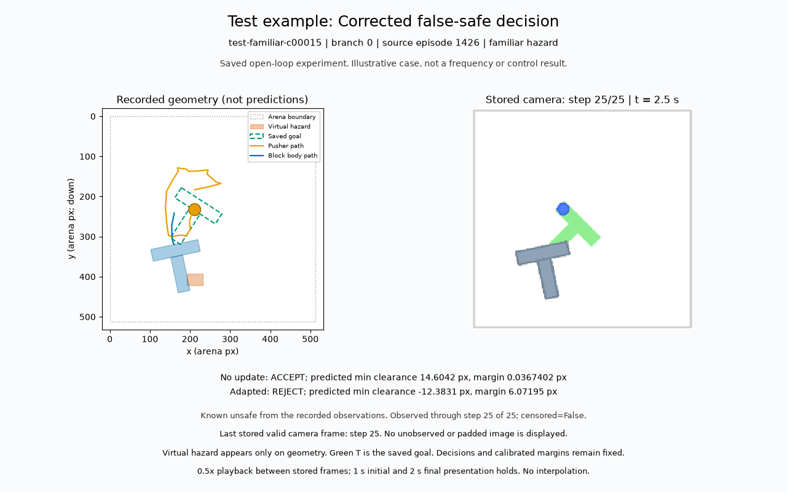
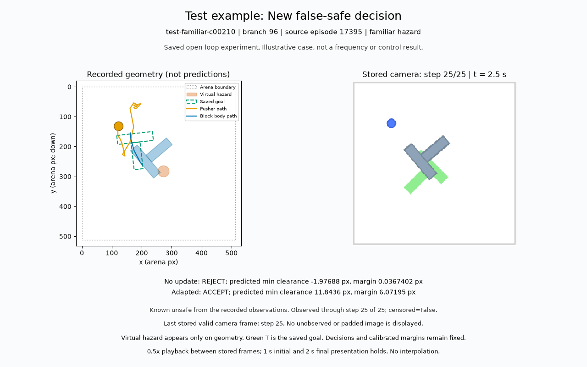
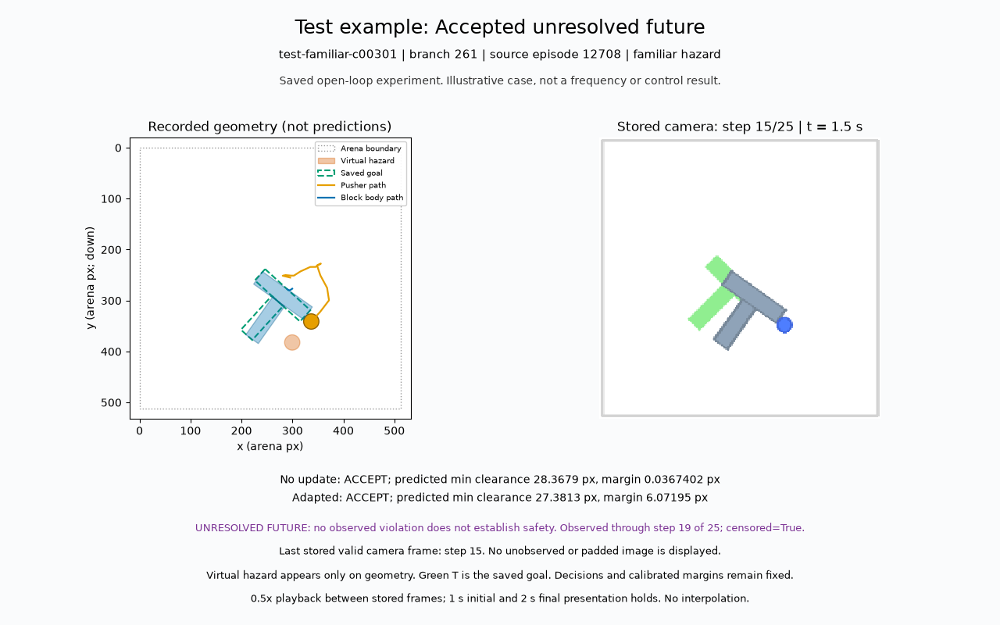

# Saved Push-T E2 test animations

These three categories use the examples already selected in the immutable paired report. No new example selection, predictions, simulator replay or statistics were added.

**The E2 repair gate remains false.** These illustrations do not establish improvement, prevalence or closed-loop control. The development ranking was inconclusive: 0 eligible recipes out of 16; the saved deterministic fallback is retained.

Actual camera images were stored every five 0.1 s environment steps. Geometry uses saved observed states through the displayed camera step. The virtual hazard is drawn only in the geometry panel; the green T is the saved goal. No predicted trajectory is drawn.

Playback is 0.5x between stored endpoints, with a 1 s initial and 2 s final hold. Held images are presentation repeats, not new observations. MP4 is lossy and GIF is resized/palette encoded; source frame byte hashes are recorded separately.

## Corrected false-safe decision

Known unsafe: no update accepts, adapted rejects.

Root `test-familiar-c00015`, branch 0; camera steps `[0, 5, 10, 15, 20, 25]`; 8 s presentation.

No update: ACCEPT; predicted min clearance 14.6042 px, margin 0.0367402 px   |   Adapted: REJECT; predicted min clearance -12.3831 px, margin 6.07195 px

Known unsafe from the recorded observations. Observed through step 25 of 25; censored=False.

The last camera frame is step 25; saved observed states end at step 25. No padded suffix is shown.

[MP4 video](test-corrected_false_safe.mp4) | [Looping GIF](test-corrected_false_safe.gif)

## New false-safe decision

Known unsafe: no update rejects, adapted accepts.

Root `test-familiar-c00210`, branch 96; camera steps `[0, 5, 10, 15, 20, 25]`; 8 s presentation.

No update: REJECT; predicted min clearance -1.97688 px, margin 0.0367402 px   |   Adapted: ACCEPT; predicted min clearance 11.8436 px, margin 6.07195 px

Known unsafe from the recorded observations. Observed through step 25 of 25; censored=False.

The last camera frame is step 25; saved observed states end at step 25. No padded suffix is shown.

[MP4 video](test-new_false_safe.mp4) | [Looping GIF](test-new_false_safe.gif)

## Accepted unresolved future

No observed violation, censored future, either model accepts.

Root `test-familiar-c00301`, branch 261; camera steps `[0, 5, 10, 15]`; 6 s presentation.

No update: ACCEPT; predicted min clearance 28.3679 px, margin 0.0367402 px   |   Adapted: ACCEPT; predicted min clearance 27.3813 px, margin 6.07195 px

UNRESOLVED FUTURE: no observed violation does not establish safety. Observed through step 19 of 25; censored=True.

The last camera frame is step 15; saved observed states end at step 19. No padded suffix is shown.

[MP4 video](test-unresolved_accepted_future.mp4) | [Looping GIF](test-unresolved_accepted_future.gif)
