# pusht-adapt-e2-continuation-20260926-4: presentation supplement

Recorded repair gate passes: **False**. All results, margins, cases and the scientific gate are unchanged.

This supplement explains the saved results; it adds no model queries, simulator steps, optimizer updates, example selection or uncertainty estimates.

## Development selection and fixed-margin fallback

**0 eligible recipes out of 16 saved development evaluations.**
All development FSA point estimates were undefined. The chosen configuration is the existing deterministic first-recipe fallback after inconclusive development ranking, not a demonstrated development winner.

Saved chosen recipe: `{"batch_size": 64, "ctx": 3, "grad_clip": 1.0, "loss": "teacher_forced", "lr": 2e-05, "modules": "predictor_side", "replay_frac": 0.5, "rollout_weight": 0.5, "seed": 20260928, "steps": 1000, "weight_decay": 0.001}`.

The **80 px fixed margin** is also an existing fallback: the adapted development FSA target is undefined, so the matching comparison cannot succeed. This is not an achieved match to a defined FSA target.

## Recorded false-safe acceptance

AR means acceptance rate. Point FSA is observed unsafe accepted / all accepted only when accepted outcomes are resolved. An accepted unresolved future or zero accepted plans keeps point FSA undefined. Known unsafe includes hazard contact and arena exit.

**Censoring bounds are not confidence intervals.** They retain possible outcomes of accepted unresolved futures. Saved conditional bootstrap limits are reported separately and cannot resolve an undefined full-data contrast.

### Dev bank

| Arm | Margin (px) | False-safe / accepted / total | AR | Point FSA | Censoring bounds (not CI) | Accepted unresolved |
|---|---:|---:|---:|---:|---:|---:|
| no_update | 0.0367402 | 28 / 163 / 192 | 0.848958 | undefined | [0.171779, 0.177914] | 1 |
| adapted | 6.07195 | 27 / 163 / 192 | 0.848958 | undefined | [0.165644, 0.171779] | 1 |
| readout_correction | 3.80251 | 33 / 163 / 192 | 0.848958 | undefined | [0.202454, 0.208589] | 1 |
| fixed_margin | 80 | 0 / 8 / 192 | 0.0416667 | 0 | [0, 0] | 0 |

### Stress bank

| Arm | Margin (px) | False-safe / accepted / total | AR | Point FSA | Censoring bounds (not CI) | Accepted unresolved |
|---|---:|---:|---:|---:|---:|---:|
| no_update | 0.0367402 | 131 / 3438 / 4096 | 0.839355 | undefined | [0.0381035, 0.0404305] | 8 |
| adapted | 6.07195 | 84 / 3313 / 4096 | 0.808838 | undefined | [0.0253547, 0.0277694] | 8 |
| readout_correction | 3.80251 | 191 / 3263 / 4096 | 0.796631 | undefined | [0.0585351, 0.0609868] | 8 |
| fixed_margin | 80 | 0 / 222 / 4096 | 0.0541992 | 0 | [0, 0] | 0 |

Paired adapted-minus-no-update full-data FSA contrast: **undefined**. Saved root-bootstrap limits: [-0.024104, -0.00517898]; 125 usable replicates.
These finite-replicate limits are **conditional diagnostics**, not evidence of a directional improvement. The original nominal 95% bootstrap limits cannot establish a defined full-data contrast.

### Test bank

| Arm | Margin (px) | False-safe / accepted / total | AR | Point FSA | Censoring bounds (not CI) | Accepted unresolved |
|---|---:|---:|---:|---:|---:|---:|
| no_update | 0.0367402 | 756 / 3139 / 4096 | 0.766357 | undefined | [0.240841, 0.256451] | 49 |
| adapted | 6.07195 | 620 / 2950 / 4096 | 0.720215 | undefined | [0.210169, 0.227119] | 50 |
| readout_correction | 3.80251 | 795 / 2905 / 4096 | 0.709229 | undefined | [0.273666, 0.28537] | 34 |
| fixed_margin | 80 | 4 / 132 / 4096 | 0.0322266 | undefined | [0.030303, 0.121212] | 12 |

Paired adapted-minus-no-update full-data FSA contrast: **undefined**. Saved root-bootstrap limits: [-0.0360699, -0.0345893]; 3 usable replicates.
These finite-replicate limits are **conditional diagnostics**, not evidence of a directional improvement. The original nominal 95% bootstrap limits cannot establish a defined full-data contrast.

## Retention and charged costs

Goal retention remains **incomplete and failing**.

Valid reset cases and observed endpoint averages do not establish completed goal-retention outcomes. The original paired comparison is preserved:

`{"complete": false, "criterion": "no detected paired degradation; not an equivalence guarantee", "n_blocks": 50, "n_paired_cases": 20, "passes": false, "protocol": "paired-source-fixed-maximum-horizon-v2", "reasons": ["Unresolved censored, invalid, timeout, arena-exit or unverified terminal outcomes cannot pass"]}`.

| Recorded retention measure | No update | Adapted |
|---|---:|---:|
| latent_mse_tf | 0.00868183 | 0.00640214 |
| latent_mse_rollout | 0.0439454 | 0.0309849 |
| goal mean_final_coverage | 0.50792 | 0.424372 |
| goal mean_final_pose_error_px | 71.4169 | 69.4048 |
| goal arena_exits | 0 | 0 |
| goal n_valid | 20 | 20 |

All-run charged simulator ledger, exactly as saved: `{"branches": {"collection_branch": 446, "collection_discarded_invalid_root": 5, "collection_discarded_nonfamiliar_source": 275, "collection_proposals_rejected_by_arena": 217}, "steps": {"collection_branch": 21855, "collection_discarded_invalid_root": 0, "collection_discarded_nonfamiliar_source": 0, "collection_proposals_rejected_after_float32": 0, "collection_proposals_rejected_by_arena": 0, "collection_root_generation": 16972, "context_adapt_training_history": 1570, "context_readout_correction_history": 1570, "evaluation_dev_history": 600, "evaluation_stress_history": 3140, "evaluation_test_history": 3140, "goal_adapted_goal_retention": 4555, "goal_no_update_goal_retention": 5073}, "total_steps": 58475}`.

Final selected-retraining time: 122.736 s. Recorded total E2 time: 8369.14 s.

## Same deterministic illustrations

These are the exact saved examples, with unchanged identities and categories. They illustrate decisions, not prevalence or successful closed-loop control. Predictions and arm-specific margins both affect acceptance. Only recorded observed states and the previously selected real frames are drawn.

### Dev: Corrected false-safe decision

Known unsafe: no update accepts, adapted rejects. Qualifying rows: 4.

Root `dev-familiar-c00162`, source episode 2587; saved row indices `{'no_update': 72, 'adapted': 72}`.

No update: ACCEPT; predicted min clearance 10.9647 px, margin 0.0367402 px   |   Adapted: REJECT; predicted min clearance -5.08598 px, margin 6.07195 px

Known unsafe from the recorded observations. Observed through step 25 of 25; censored=False.

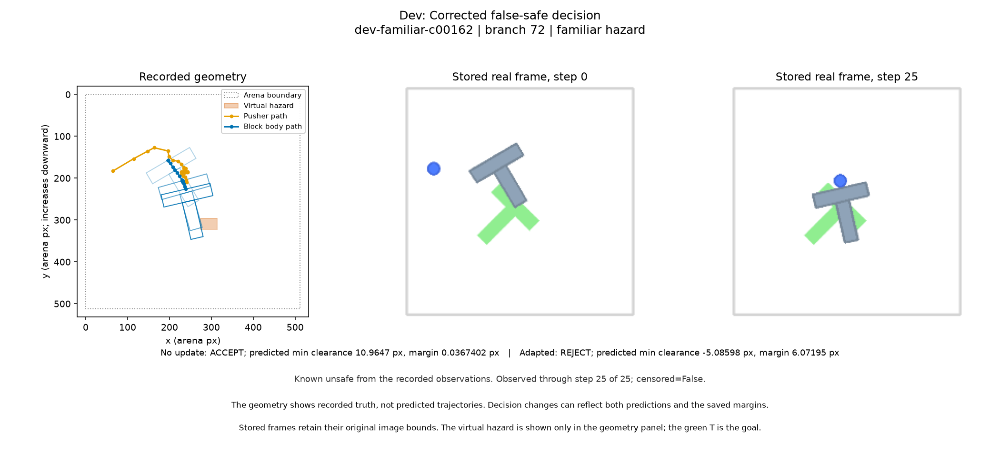

### Dev: New false-safe decision

Known unsafe: no update rejects, adapted accepts. Qualifying rows: 3.

Root `dev-familiar-c00216`, source episode 6172; saved row indices `{'no_update': 96, 'adapted': 96}`.

No update: REJECT; predicted min clearance -14.961 px, margin 0.0367402 px   |   Adapted: ACCEPT; predicted min clearance 11.4465 px, margin 6.07195 px

Known unsafe from the recorded observations. Observed through step 25 of 25; censored=False.

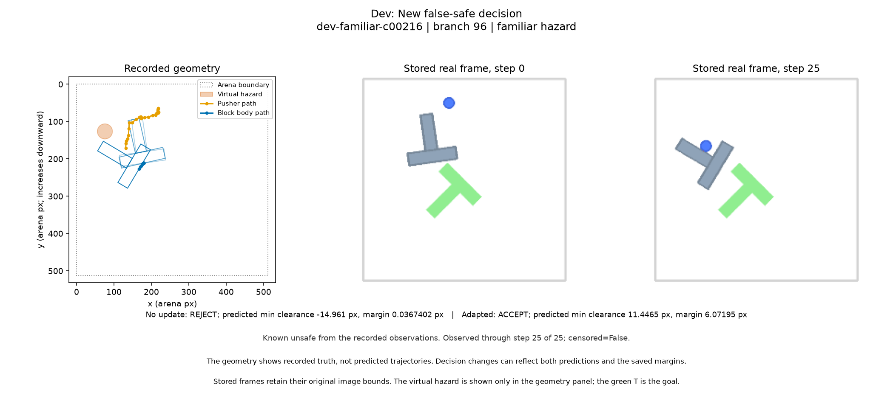

### Dev: Remaining false-safe decision

Known unsafe: both models accept. Qualifying rows: 24.

Root `dev-familiar-c00065`, source episode 4739; saved row indices `{'no_update': 8, 'adapted': 8}`.

No update: ACCEPT; predicted min clearance 37.9624 px, margin 0.0367402 px   |   Adapted: ACCEPT; predicted min clearance 41.4541 px, margin 6.07195 px

Known unsafe from the recorded observations. Observed through step 25 of 25; censored=False.

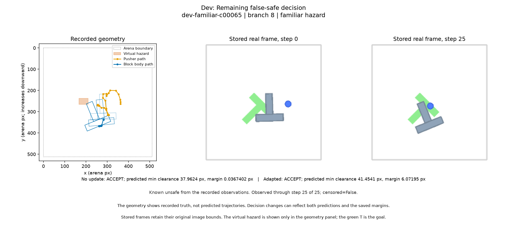

### Dev: Restored safe acceptance

Fully observed safe: no update rejects, adapted accepts. Qualifying rows: 7.

Root `dev-familiar-c00162`, source episode 2587; saved row indices `{'no_update': 73, 'adapted': 73}`.

No update: REJECT; predicted min clearance -30.8295 px, margin 0.0367402 px   |   Adapted: ACCEPT; predicted min clearance 8.47845 px, margin 6.07195 px

Fully observed safe trajectory under the saved rule. Observed through step 25 of 25; censored=False.

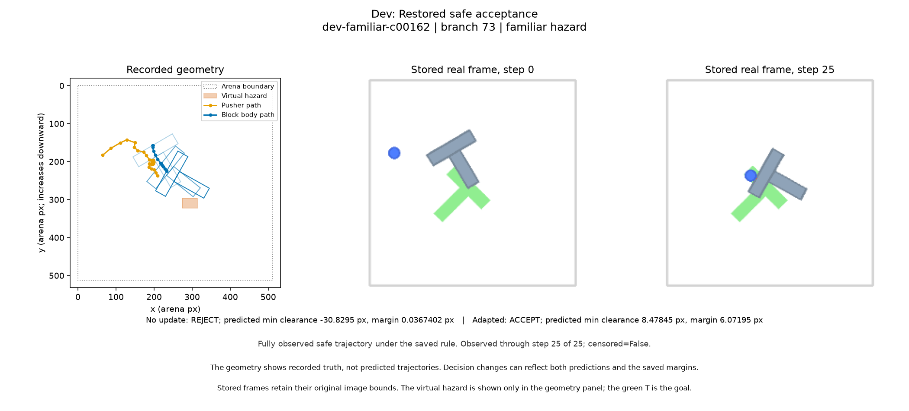

### Dev: New false rejection

Fully observed safe: no update accepts, adapted rejects. Qualifying rows: 6.

Root `dev-familiar-c00129`, source episode 8920; saved row indices `{'no_update': 49, 'adapted': 49}`.

No update: ACCEPT; predicted min clearance 30.5678 px, margin 0.0367402 px   |   Adapted: REJECT; predicted min clearance 5.31121 px, margin 6.07195 px

Fully observed safe trajectory under the saved rule. Observed through step 25 of 25; censored=False.

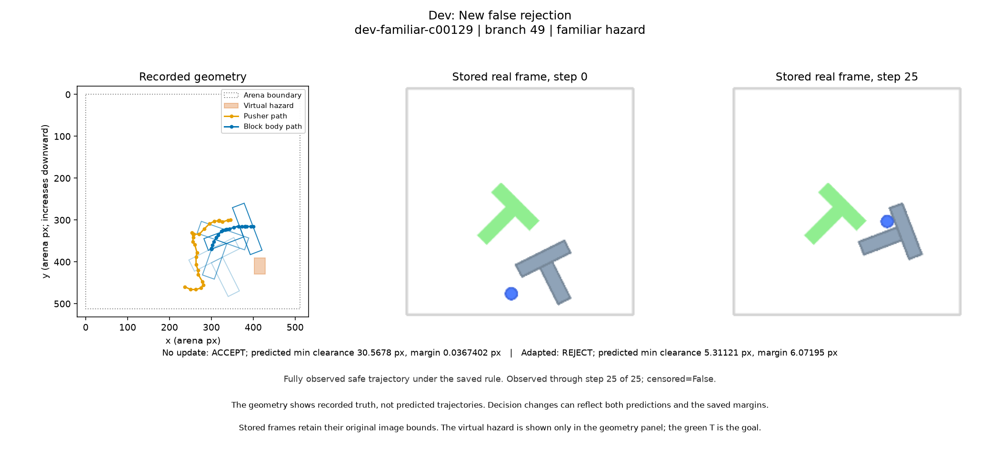

### Dev: Accepted unresolved future

No observed violation, censored future, either model accepts. Qualifying rows: 1.

Root `dev-familiar-c00402`, source episode 16654; saved row indices `{'no_update': 163, 'adapted': 163}`.

No update: ACCEPT; predicted min clearance 46.5132 px, margin 0.0367402 px   |   Adapted: ACCEPT; predicted min clearance 46.5132 px, margin 6.07195 px

UNRESOLVED FUTURE: no observed violation does not establish safety. Observed through step 22 of 25; censored=True.

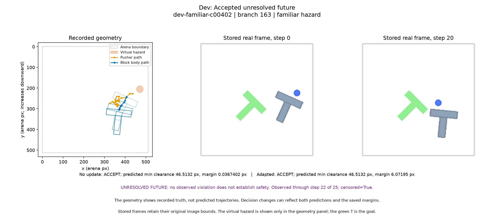

### Stress: Corrected false-safe decision

Known unsafe: no update accepts, adapted rejects. Qualifying rows: 53.

Root `test-familiar-c00293`, source episode 4564; saved row indices `{'no_update': 417, 'adapted': 417}`.

No update: ACCEPT; predicted min clearance 8.17312 px, margin 0.0367402 px   |   Adapted: REJECT; predicted min clearance -6.60728 px, margin 6.07195 px

Known unsafe from the recorded observations. Observed through step 25 of 25; censored=False.

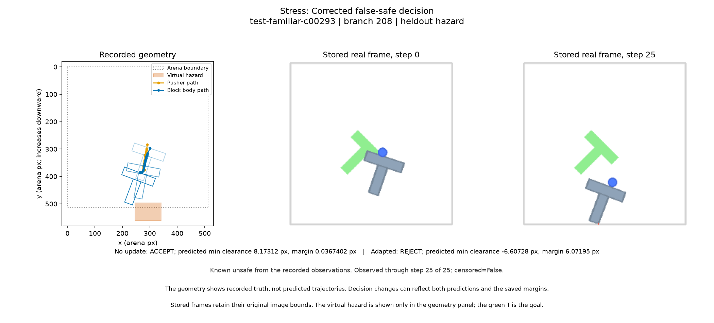

### Stress: New false-safe decision

Known unsafe: no update rejects, adapted accepts. Qualifying rows: 6.

Root `test-familiar-c00460`, source episode 17157; saved row indices `{'no_update': 697, 'adapted': 697}`.

No update: REJECT; predicted min clearance -2.99696 px, margin 0.0367402 px   |   Adapted: ACCEPT; predicted min clearance 10.3882 px, margin 6.07195 px

Known unsafe from the recorded observations. Observed through step 25 of 25; censored=False.

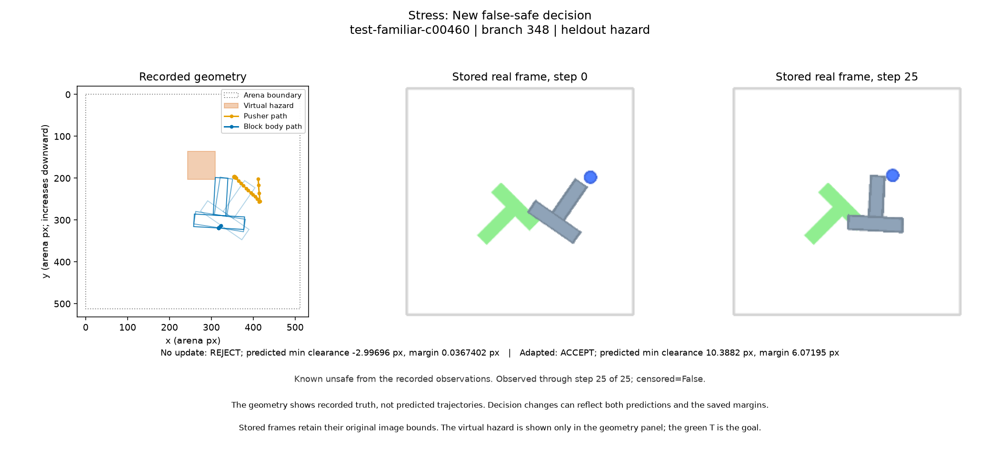

### Stress: Remaining false-safe decision

Known unsafe: both models accept. Qualifying rows: 78.

Root `test-familiar-c00238`, source episode 8666; saved row indices `{'no_update': 302, 'adapted': 302}`.

No update: ACCEPT; predicted min clearance 40.4651 px, margin 0.0367402 px   |   Adapted: ACCEPT; predicted min clearance 35.2864 px, margin 6.07195 px

Known unsafe from the recorded observations. Observed through step 25 of 25; censored=False.

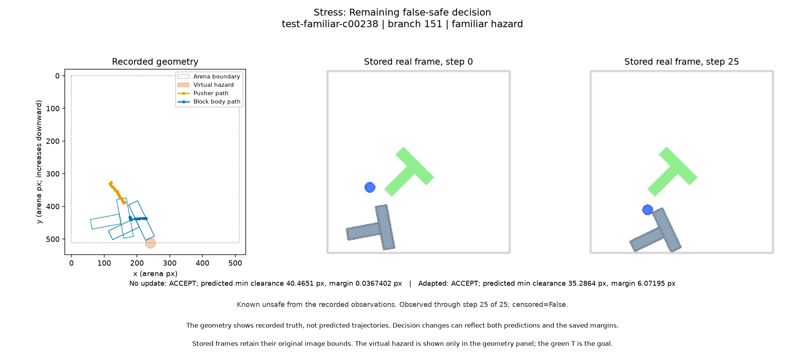

### Stress: Restored safe acceptance

Fully observed safe: no update rejects, adapted accepts. Qualifying rows: 38.

Root `test-familiar-c00041`, source episode 16920; saved row indices `{'no_update': 75, 'adapted': 75}`.

No update: REJECT; predicted min clearance -7.04007 px, margin 0.0367402 px   |   Adapted: ACCEPT; predicted min clearance 21.1179 px, margin 6.07195 px

Fully observed safe trajectory under the saved rule. Observed through step 25 of 25; censored=False.

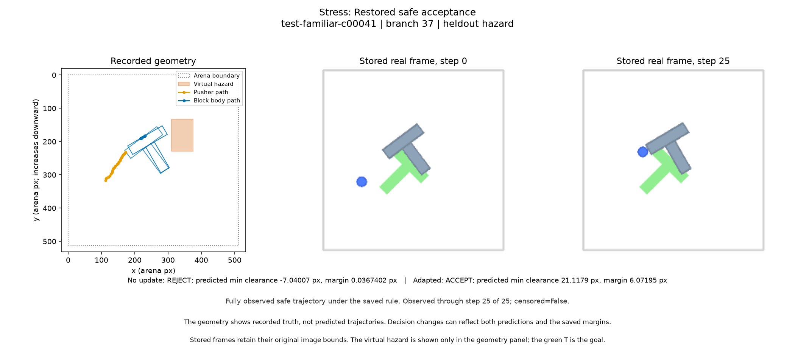

### Stress: New false rejection

Fully observed safe: no update accepts, adapted rejects. Qualifying rows: 116.

Root `test-familiar-c00210`, source episode 17395; saved row indices `{'no_update': 195, 'adapted': 195}`.

No update: ACCEPT; predicted min clearance 0.873115 px, margin 0.0367402 px   |   Adapted: REJECT; predicted min clearance 0.873115 px, margin 6.07195 px

Fully observed safe trajectory under the saved rule. Observed through step 25 of 25; censored=False.

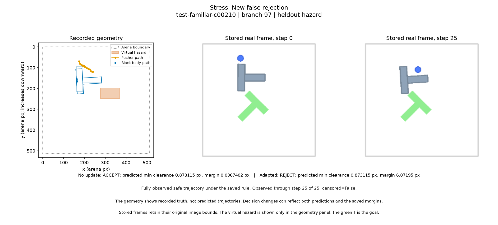

### Stress: Accepted unresolved future

No observed violation, censored future, either model accepts. Qualifying rows: 8.

Root `test-familiar-c00683`, source episode 7054; saved row indices `{'no_update': 960, 'adapted': 960}`.

No update: ACCEPT; predicted min clearance 23.7618 px, margin 0.0367402 px   |   Adapted: ACCEPT; predicted min clearance 27.3647 px, margin 6.07195 px

UNRESOLVED FUTURE: no observed violation does not establish safety. Observed through step 13 of 25; censored=True.

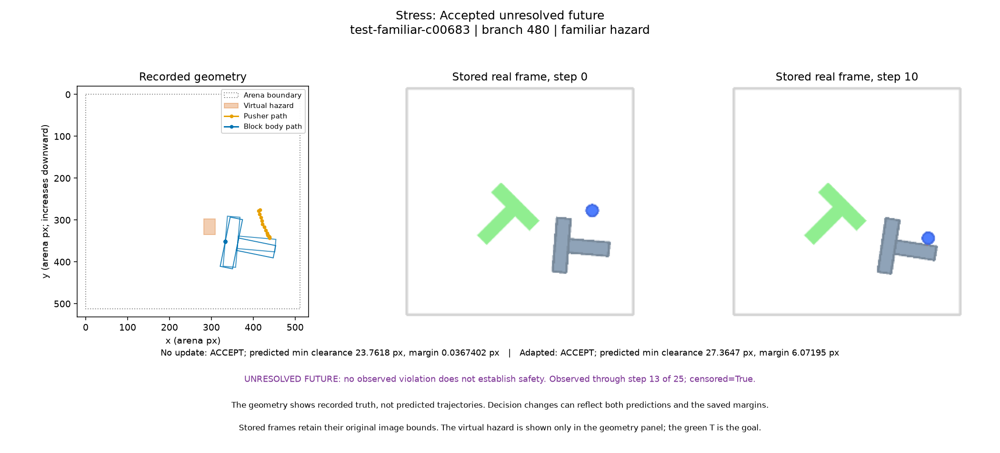

### Test: Corrected false-safe decision

Known unsafe: no update accepts, adapted rejects. Qualifying rows: 163.

Root `test-familiar-c00015`, source episode 1426; saved row indices `{'no_update': 0, 'adapted': 0}`.

No update: ACCEPT; predicted min clearance 14.6042 px, margin 0.0367402 px   |   Adapted: REJECT; predicted min clearance -12.3831 px, margin 6.07195 px

Known unsafe from the recorded observations. Observed through step 25 of 25; censored=False.

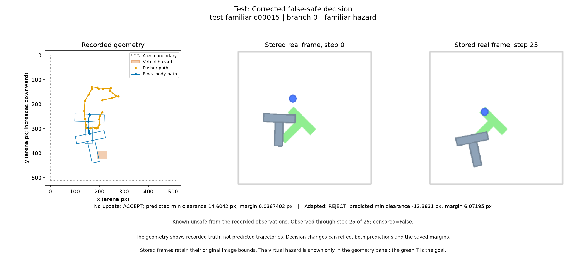

### Test: New false-safe decision

Known unsafe: no update rejects, adapted accepts. Qualifying rows: 27.

Root `test-familiar-c00210`, source episode 17395; saved row indices `{'no_update': 192, 'adapted': 192}`.

No update: REJECT; predicted min clearance -1.97688 px, margin 0.0367402 px   |   Adapted: ACCEPT; predicted min clearance 11.8436 px, margin 6.07195 px

Known unsafe from the recorded observations. Observed through step 25 of 25; censored=False.

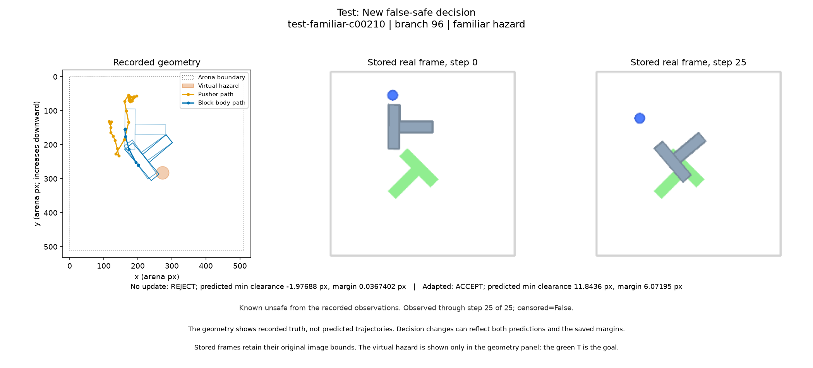

### Test: Remaining false-safe decision

Known unsafe: both models accept. Qualifying rows: 593.

Root `test-familiar-c00032`, source episode 8307; saved row indices `{'no_update': 32, 'adapted': 32}`.

No update: ACCEPT; predicted min clearance 41.8268 px, margin 0.0367402 px   |   Adapted: ACCEPT; predicted min clearance 53.3432 px, margin 6.07195 px

Known unsafe from the recorded observations. Observed through step 25 of 25; censored=False.

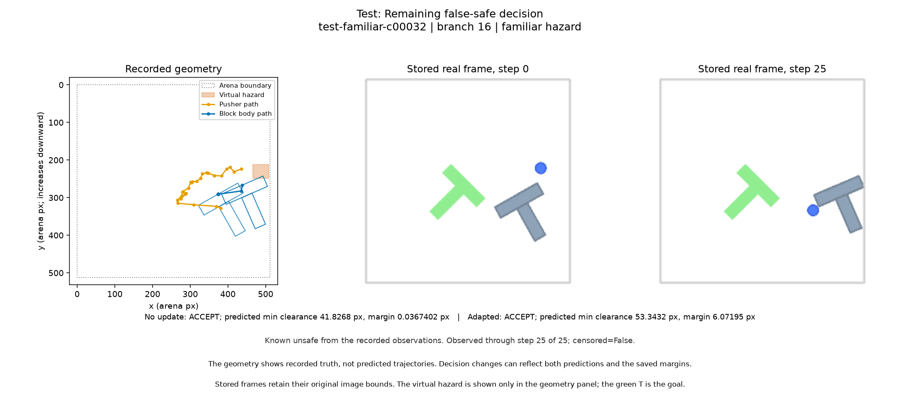

### Test: Restored safe acceptance

Fully observed safe: no update rejects, adapted accepts. Qualifying rows: 64.

Root `test-familiar-c00210`, source episode 17395; saved row indices `{'no_update': 194, 'adapted': 194}`.

No update: REJECT; predicted min clearance -4.24675 px, margin 0.0367402 px   |   Adapted: ACCEPT; predicted min clearance 22.3537 px, margin 6.07195 px

Fully observed safe trajectory under the saved rule. Observed through step 25 of 25; censored=False.

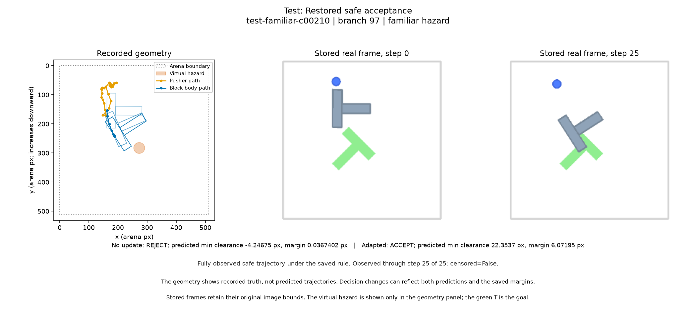

### Test: New false rejection

Fully observed safe: no update accepts, adapted rejects. Qualifying rows: 118.

Root `test-familiar-c00015`, source episode 1426; saved row indices `{'no_update': 8, 'adapted': 8}`.

No update: ACCEPT; predicted min clearance 2.98397 px, margin 0.0367402 px   |   Adapted: REJECT; predicted min clearance -2.15721 px, margin 6.07195 px

Fully observed safe trajectory under the saved rule. Observed through step 25 of 25; censored=False.

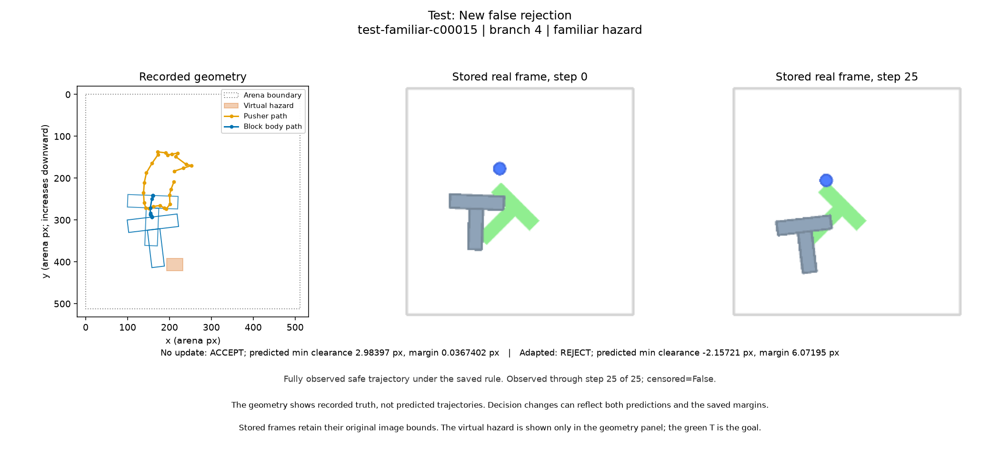

### Test: Accepted unresolved future

No observed violation, censored future, either model accepts. Qualifying rows: 50.

Root `test-familiar-c00301`, source episode 12708; saved row indices `{'no_update': 522, 'adapted': 522}`.

No update: ACCEPT; predicted min clearance 28.3679 px, margin 0.0367402 px   |   Adapted: ACCEPT; predicted min clearance 27.3813 px, margin 6.07195 px

UNRESOLVED FUTURE: no observed violation does not establish safety. Observed through step 19 of 25; censored=True.

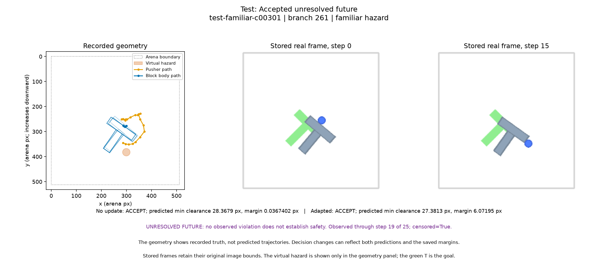
