# pusht-adapt-e2-continuation-20260926-4: paired repair report

Recorded repair gate passes: **False**. This report preserves the original gate and development-selected margins.

All saved rows enter the tables. Known unsafe includes hazard contact and arena exits. An accepted unresolved future makes point FSA undefined; the lower/upper bounds retain the missing outcome.

| Bank | Arm | Margin | False-safe / accepted / total | AR | FSA | FSA bounds | Accepted unresolved |
|---|---|---:|---:|---:|---:|---:|---:|
| dev | no_update | 0.03674 | 28 / 163 / 192 | 0.849 | undefined | [0.1718, 0.1779] | 1 |
| dev | adapted | 6.072 | 27 / 163 / 192 | 0.849 | undefined | [0.1656, 0.1718] | 1 |
| dev | readout_correction | 3.803 | 33 / 163 / 192 | 0.849 | undefined | [0.2025, 0.2086] | 1 |
| dev | fixed_margin | 80 | 0 / 8 / 192 | 0.04167 | 0 | [0, 0] | 0 |
| stress | no_update | 0.03674 | 131 / 3438 / 4096 | 0.8394 | undefined | [0.0381, 0.04043] | 8 |
| stress | adapted | 6.072 | 84 / 3313 / 4096 | 0.8088 | undefined | [0.02535, 0.02777] | 8 |
| stress | readout_correction | 3.803 | 191 / 3263 / 4096 | 0.7966 | undefined | [0.05854, 0.06099] | 8 |
| stress | fixed_margin | 80 | 0 / 222 / 4096 | 0.0542 | 0 | [0, 0] | 0 |

stress: paired adapted-minus-no-update FSA undefined, recorded 95% root-bootstrap interval [-0.0241, -0.005179], 125 usable replicates. The full-data contrast is undefined; finite conditional bootstrap limits do not establish an improvement.
| test | no_update | 0.03674 | 756 / 3139 / 4096 | 0.7664 | undefined | [0.2408, 0.2565] | 49 |
| test | adapted | 6.072 | 620 / 2950 / 4096 | 0.7202 | undefined | [0.2102, 0.2271] | 50 |
| test | readout_correction | 3.803 | 795 / 2905 / 4096 | 0.7092 | undefined | [0.2737, 0.2854] | 34 |
| test | fixed_margin | 80 | 4 / 132 / 4096 | 0.03223 | undefined | [0.0303, 0.1212] | 12 |

test: paired adapted-minus-no-update FSA undefined, recorded 95% root-bootstrap interval [-0.03607, -0.03459], 3 usable replicates. The full-data contrast is undefined; finite conditional bootstrap limits do not establish an improvement.

## Charged costs and retention

Adaptation collection: {"branches": {"branch": 446, "discarded_invalid_root": 5, "discarded_nonfamiliar_source": 275, "proposals_rejected_by_arena": 217}, "steps": {"branch": 21855, "discarded_invalid_root": 0, "discarded_nonfamiliar_source": 0, "proposals_rejected_after_float32": 0, "proposals_rejected_by_arena": 0, "root_generation": 16972}, "total_steps": 38827}.

All actual E2 simulator work, including context replays and goal retention: `{"branches": {"collection_branch": 446, "collection_discarded_invalid_root": 5, "collection_discarded_nonfamiliar_source": 275, "collection_proposals_rejected_by_arena": 217}, "steps": {"collection_branch": 21855, "collection_discarded_invalid_root": 0, "collection_discarded_nonfamiliar_source": 0, "collection_proposals_rejected_after_float32": 0, "collection_proposals_rejected_by_arena": 0, "collection_root_generation": 16972, "context_adapt_training_history": 1570, "context_readout_correction_history": 1570, "evaluation_dev_history": 600, "evaluation_stress_history": 3140, "evaluation_test_history": 3140, "goal_adapted_goal_retention": 4555, "goal_no_update_goal_retention": 5073}, "total_steps": 58475}`. Existing bank-generation costs remain in upstream manifests.

Chosen recipe: `{"batch_size": 64, "ctx": 3, "grad_clip": 1.0, "loss": "teacher_forced", "lr": 2e-05, "modules": "predictor_side", "replay_frac": 0.5, "rollout_weight": 0.5, "seed": 20260928, "steps": 1000, "weight_decay": 0.001}`. Final training time: 122.7 s. Recorded total run time: 8369 s.

Recipe-grid training costs, final training log, separate baseline/adapted goal-retention ledgers and ordinary-motion summaries are preserved in paired_report.json. Generating this report adds zero simulator steps, model queries or optimizer updates.

| Retention | No update | Adapted |
|---|---:|---:|
| latent_mse_tf | 0.008682 | 0.006402 |
| latent_mse_rollout | 0.04395 | 0.03098 |
| goal mean_final_coverage | 0.5079 | 0.4244 |
| goal mean_final_pose_error_px | 71.42 | 69.4 |
| goal arena_exits | 0 | 0 |
| goal n_valid | 20 | 20 |

Recorded paired goal-retention comparison: `{"complete": false, "criterion": "no detected paired degradation; not an equivalence guarantee", "n_blocks": 50, "n_paired_cases": 20, "passes": false, "protocol": "paired-source-fixed-maximum-horizon-v2", "reasons": ["Unresolved censored, invalid, timeout, arena-exit or unverified terminal outcomes cannot pass"]}`.

## Deterministic illustrations

For each category and bank, show the first qualifying row sorted by numeric root index, branch index and layout family. Categories may be absent. These examples illustrate decisions, not prevalence or closed-loop goal-reaching success. No case was selected for a large error magnitude; every unselected outcome remains in the tables and original hashed NPZ. Frames and traces come only from recorded observations; padded future frames are omitted.

### dev: corrected_false_safe

Known unsafe: no update accepts, adapted rejects. Qualifying rows: 4.

Root `dev-familiar-c00162` (source episode 2587), branch 72, layout `familiar`; saved row indices `{'no_update': 72, 'adapted': 72}`. Predicted minimum clearance: 10.96 to -5.086 px; margins 0.03674 and 6.072 px. Censored=False, unresolved=False.

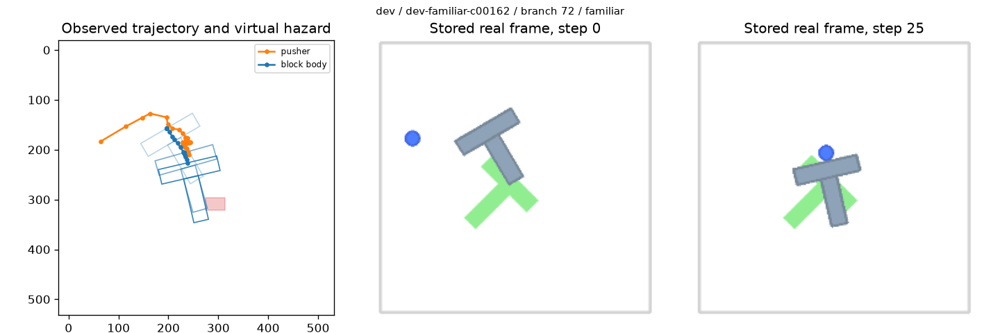

### dev: new_false_safe

Known unsafe: no update rejects, adapted accepts. Qualifying rows: 3.

Root `dev-familiar-c00216` (source episode 6172), branch 96, layout `familiar`; saved row indices `{'no_update': 96, 'adapted': 96}`. Predicted minimum clearance: -14.96 to 11.45 px; margins 0.03674 and 6.072 px. Censored=False, unresolved=False.

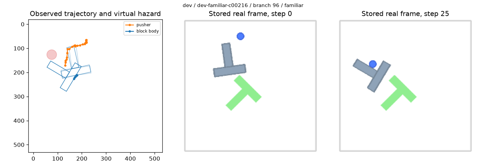

### dev: remaining_false_safe

Known unsafe: both models accept. Qualifying rows: 24.

Root `dev-familiar-c00065` (source episode 4739), branch 8, layout `familiar`; saved row indices `{'no_update': 8, 'adapted': 8}`. Predicted minimum clearance: 37.96 to 41.45 px; margins 0.03674 and 6.072 px. Censored=False, unresolved=False.

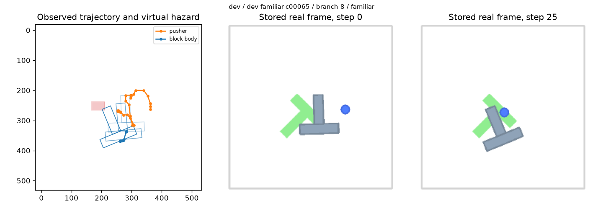

### dev: restored_safe_acceptance

Fully observed safe: no update rejects, adapted accepts. Qualifying rows: 7.

Root `dev-familiar-c00162` (source episode 2587), branch 73, layout `familiar`; saved row indices `{'no_update': 73, 'adapted': 73}`. Predicted minimum clearance: -30.83 to 8.478 px; margins 0.03674 and 6.072 px. Censored=False, unresolved=False.

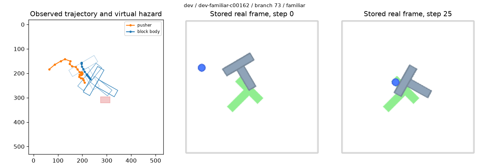

### dev: new_false_rejection

Fully observed safe: no update accepts, adapted rejects. Qualifying rows: 6.

Root `dev-familiar-c00129` (source episode 8920), branch 49, layout `familiar`; saved row indices `{'no_update': 49, 'adapted': 49}`. Predicted minimum clearance: 30.57 to 5.311 px; margins 0.03674 and 6.072 px. Censored=False, unresolved=False.

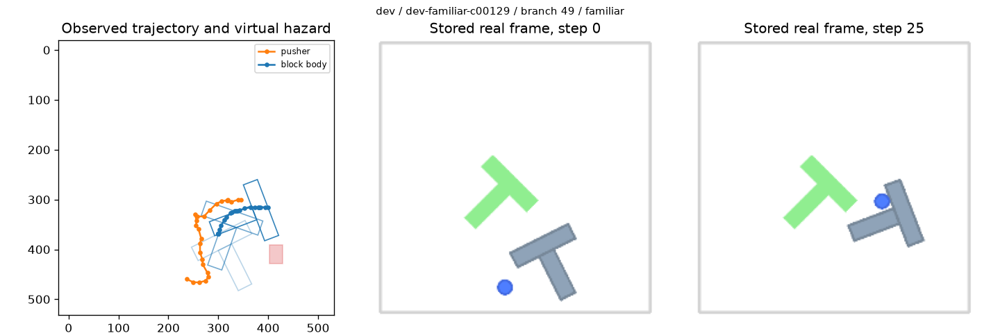

### dev: unresolved_accepted_future

No observed violation, censored future, either model accepts. Qualifying rows: 1.

Root `dev-familiar-c00402` (source episode 16654), branch 163, layout `familiar`; saved row indices `{'no_update': 163, 'adapted': 163}`. Predicted minimum clearance: 46.51 to 46.51 px; margins 0.03674 and 6.072 px. Censored=True, unresolved=True.

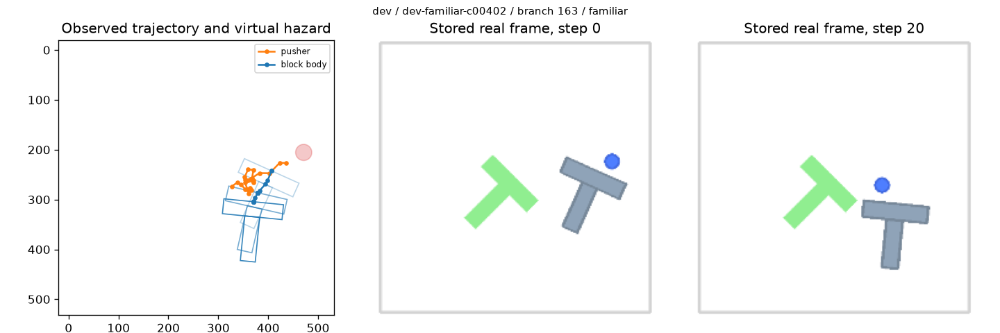

### stress: corrected_false_safe

Known unsafe: no update accepts, adapted rejects. Qualifying rows: 53.

Root `test-familiar-c00293` (source episode 4564), branch 208, layout `heldout`; saved row indices `{'no_update': 417, 'adapted': 417}`. Predicted minimum clearance: 8.173 to -6.607 px; margins 0.03674 and 6.072 px. Censored=False, unresolved=False.

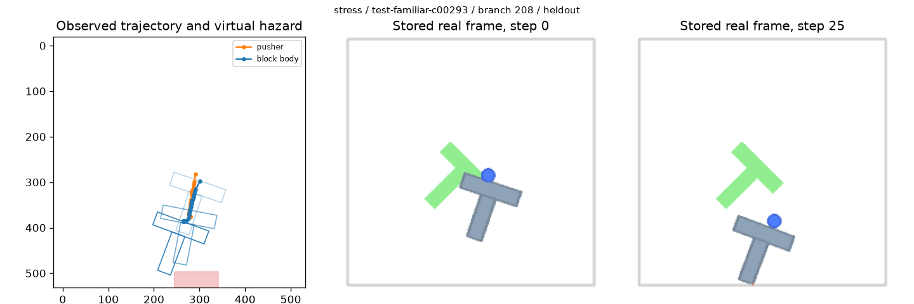

### stress: new_false_safe

Known unsafe: no update rejects, adapted accepts. Qualifying rows: 6.

Root `test-familiar-c00460` (source episode 17157), branch 348, layout `heldout`; saved row indices `{'no_update': 697, 'adapted': 697}`. Predicted minimum clearance: -2.997 to 10.39 px; margins 0.03674 and 6.072 px. Censored=False, unresolved=False.

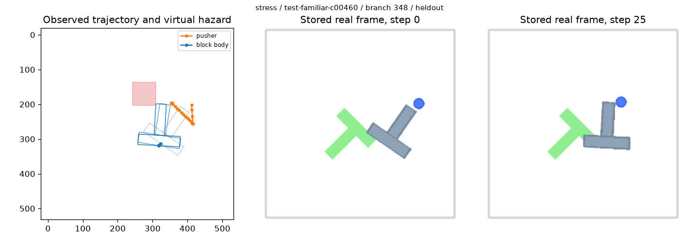

### stress: remaining_false_safe

Known unsafe: both models accept. Qualifying rows: 78.

Root `test-familiar-c00238` (source episode 8666), branch 151, layout `familiar`; saved row indices `{'no_update': 302, 'adapted': 302}`. Predicted minimum clearance: 40.47 to 35.29 px; margins 0.03674 and 6.072 px. Censored=False, unresolved=False.

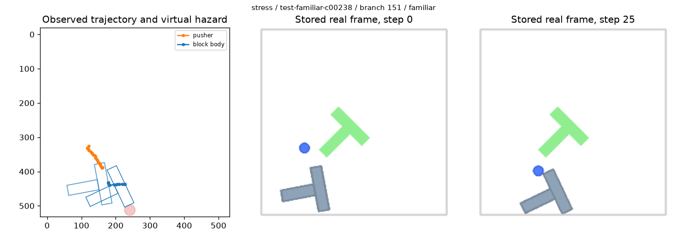

### stress: restored_safe_acceptance

Fully observed safe: no update rejects, adapted accepts. Qualifying rows: 38.

Root `test-familiar-c00041` (source episode 16920), branch 37, layout `heldout`; saved row indices `{'no_update': 75, 'adapted': 75}`. Predicted minimum clearance: -7.04 to 21.12 px; margins 0.03674 and 6.072 px. Censored=False, unresolved=False.

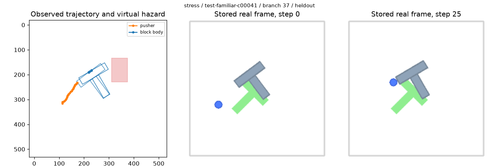

### stress: new_false_rejection

Fully observed safe: no update accepts, adapted rejects. Qualifying rows: 116.

Root `test-familiar-c00210` (source episode 17395), branch 97, layout `heldout`; saved row indices `{'no_update': 195, 'adapted': 195}`. Predicted minimum clearance: 0.8731 to 0.8731 px; margins 0.03674 and 6.072 px. Censored=False, unresolved=False.

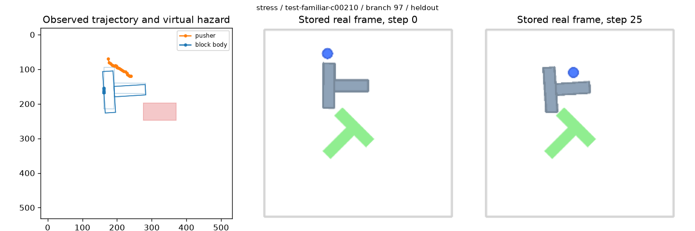

### stress: unresolved_accepted_future

No observed violation, censored future, either model accepts. Qualifying rows: 8.

Root `test-familiar-c00683` (source episode 7054), branch 480, layout `familiar`; saved row indices `{'no_update': 960, 'adapted': 960}`. Predicted minimum clearance: 23.76 to 27.36 px; margins 0.03674 and 6.072 px. Censored=True, unresolved=True.

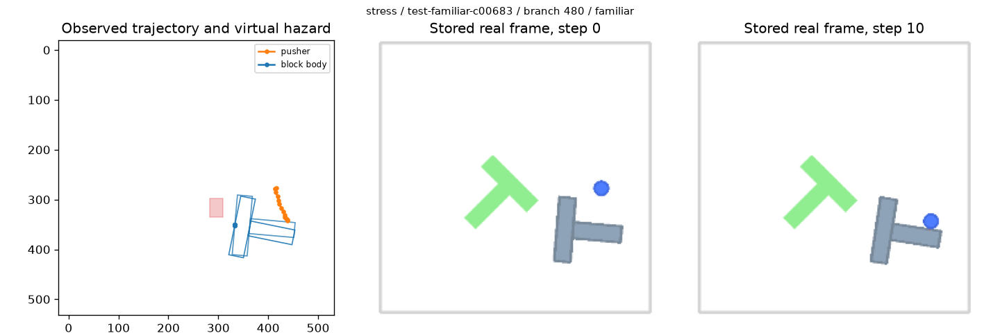

### test: corrected_false_safe

Known unsafe: no update accepts, adapted rejects. Qualifying rows: 163.

Root `test-familiar-c00015` (source episode 1426), branch 0, layout `familiar`; saved row indices `{'no_update': 0, 'adapted': 0}`. Predicted minimum clearance: 14.6 to -12.38 px; margins 0.03674 and 6.072 px. Censored=False, unresolved=False.

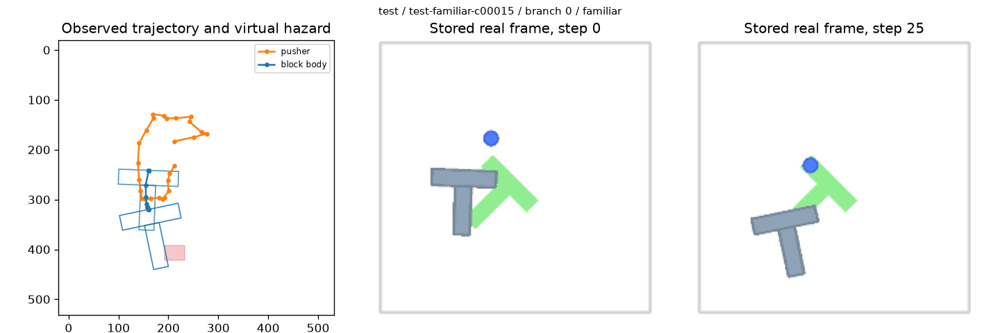

### test: new_false_safe

Known unsafe: no update rejects, adapted accepts. Qualifying rows: 27.

Root `test-familiar-c00210` (source episode 17395), branch 96, layout `familiar`; saved row indices `{'no_update': 192, 'adapted': 192}`. Predicted minimum clearance: -1.977 to 11.84 px; margins 0.03674 and 6.072 px. Censored=False, unresolved=False.

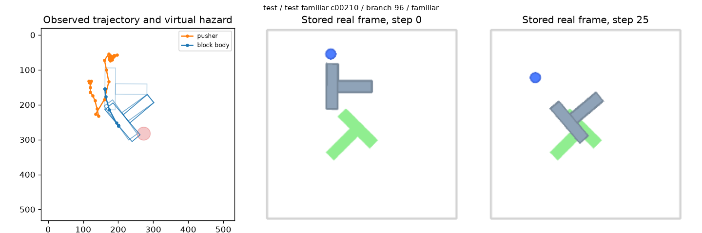

### test: remaining_false_safe

Known unsafe: both models accept. Qualifying rows: 593.

Root `test-familiar-c00032` (source episode 8307), branch 16, layout `familiar`; saved row indices `{'no_update': 32, 'adapted': 32}`. Predicted minimum clearance: 41.83 to 53.34 px; margins 0.03674 and 6.072 px. Censored=False, unresolved=False.

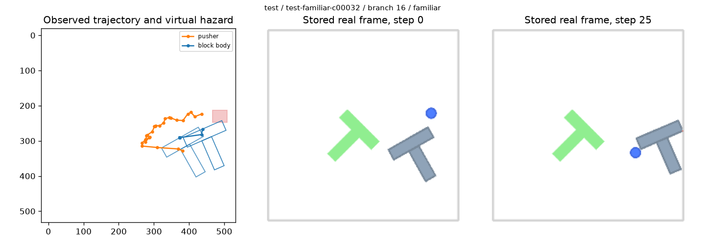

### test: restored_safe_acceptance

Fully observed safe: no update rejects, adapted accepts. Qualifying rows: 64.

Root `test-familiar-c00210` (source episode 17395), branch 97, layout `familiar`; saved row indices `{'no_update': 194, 'adapted': 194}`. Predicted minimum clearance: -4.247 to 22.35 px; margins 0.03674 and 6.072 px. Censored=False, unresolved=False.

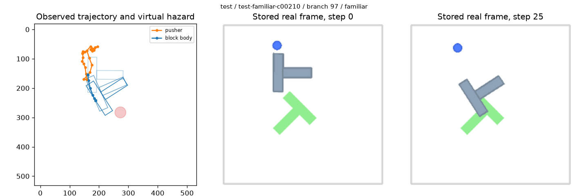

### test: new_false_rejection

Fully observed safe: no update accepts, adapted rejects. Qualifying rows: 118.

Root `test-familiar-c00015` (source episode 1426), branch 4, layout `familiar`; saved row indices `{'no_update': 8, 'adapted': 8}`. Predicted minimum clearance: 2.984 to -2.157 px; margins 0.03674 and 6.072 px. Censored=False, unresolved=False.

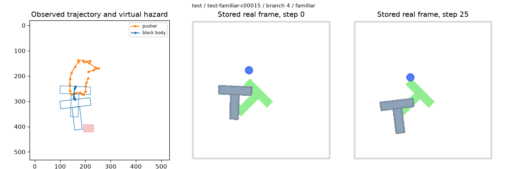

### test: unresolved_accepted_future

No observed violation, censored future, either model accepts. Qualifying rows: 50.

Root `test-familiar-c00301` (source episode 12708), branch 261, layout `familiar`; saved row indices `{'no_update': 522, 'adapted': 522}`. Predicted minimum clearance: 28.37 to 27.38 px; margins 0.03674 and 6.072 px. Censored=True, unresolved=True.

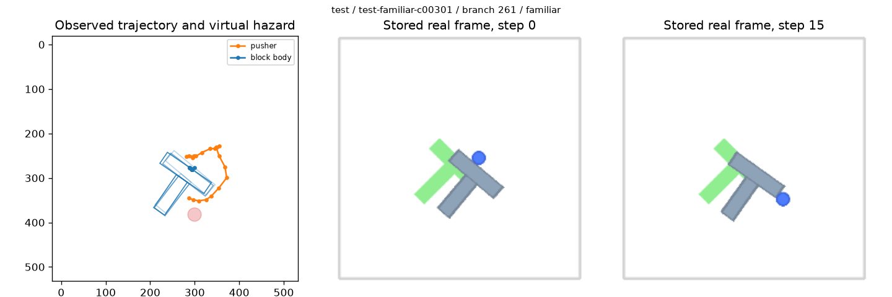
