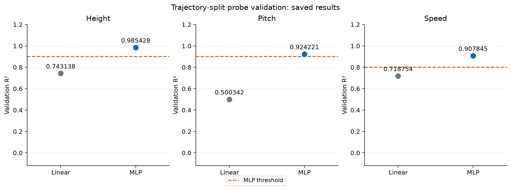
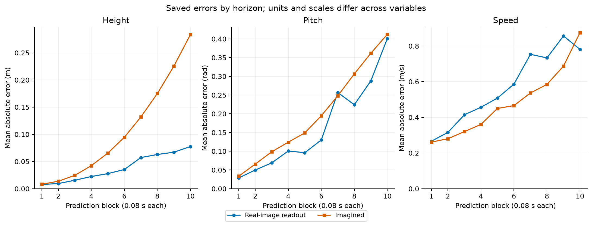

# Walker S3: Health qualification passed

Run: `walker2d-probes-recovery-20260927-1`. Role: development.

The recorded health result controls continuation. Speed is an optional additional rule; a speed failure alone does not stop a passing health result. This supplement preserves the saved gate without making a new qualification decision.

Saved active rules: health. Evidence: 192 paired branches from 64 roots.

## Probe readout

Probe metrics use a trajectory-disjoint validation partition of the separate probe collection. The gate uses the MLP probe. Linear results are a reported reference. R² thresholds and final imagined-error ceilings below come from the versioned `walkerValidation.py` protocol; its SHA is in the manifest. The gate report saves the resulting flags.

| Variable | Linear R² | MLP R² | MLP threshold | Recorded result |
| --- | --- | --- | --- | --- |
| Height | 0.743138 | 0.985428 | ≥ 0.9 | pass |
| Pitch | 0.500342 | 0.924221 | ≥ 0.9 | pass |
| Speed | 0.718754 | 0.907845 | ≥ 0.8 | pass |

## Qualification components

| Rule | Final-error ceiling | Useful error | Last > first error | Readout tracks truth | Recorded qualification |
| --- | --- | --- | --- | --- | --- |
| Health | height < 0.3 m; pitch < 0.6 rad | pass | height: pass; pitch: pass | pass | pass |
| Speed | speed < 1.0 m/s | pass | speed: pass | does not pass | does not pass |

## Real-readout decisions

Recorded minimum support: 10 unsafe and 10 safe branches per rule; unsafe recall ≥ 0.8; specificity ≥ 0.8.

| Rule | Unsafe | Safe | Unsafe detected | Safe accepted | Recall | Specificity |
| --- | --- | --- | --- | --- | --- | --- |
| Health | 71 | 121 | 67 | 107 | 0.943662 | 0.884298 |
| Speed | 160 | 32 | 143 | 15 | 0.89375 | 0.46875 |

At margin zero, acceptance is predicted clearance ≥ 0. Health truth at zero clearance is unsafe; speed truth at zero clearance is safe. FSA is unsafe accepted / all accepted. Undefined values, including zero-acceptance FSA, remain undefined.

| Rule | Prediction | Branches | Accepted | Unsafe accepted | Accepted unresolved | Acceptance rate | FSA |
| --- | --- | --- | --- | --- | --- | --- | --- |
| Health | Real-image readout | 192 | 111 | 4 | 0 | 0.578125 | 0.036036 |
| Health | Imagined | 192 | 187 | 68 | 0 | 0.973958 | 0.363636 |
| Speed | Real-image readout | 192 | 32 | 17 | 0 | 0.166667 | 0.53125 |
| Speed | Imagined | 192 | 62 | 44 | 0 | 0.322917 | 0.709677 |

## Error by prediction horizon

Each block contains 10 environment steps (0.08 s); block 10 reaches 0.8 s. Values are the saved mean absolute errors. Separate axes preserve the physical units. Gaps mean undefined values, not zero error. These means have no saved uncertainty intervals.

| Block | Height real (m) | Height imagined (m) | Pitch real (rad) | Pitch imagined (rad) | Speed real (m/s) | Speed imagined (m/s) |
| --- | --- | --- | --- | --- | --- | --- |
| 1 | 0.00776266 | 0.00815379 | 0.0288339 | 0.0334244 | 0.26608 | 0.261208 |
| 2 | 0.00942533 | 0.0136864 | 0.0498411 | 0.0656901 | 0.315652 | 0.280045 |
| 3 | 0.0155013 | 0.0244926 | 0.0689618 | 0.0985907 | 0.414195 | 0.320014 |
| 4 | 0.0223821 | 0.0423483 | 0.100679 | 0.124201 | 0.456384 | 0.360217 |
| 5 | 0.0277252 | 0.0655089 | 0.0960623 | 0.148903 | 0.508086 | 0.449822 |
| 6 | 0.035254 | 0.0945143 | 0.130114 | 0.194841 | 0.586086 | 0.465743 |
| 7 | 0.0572473 | 0.131891 | 0.256796 | 0.247993 | 0.753361 | 0.536623 |
| 8 | 0.0628963 | 0.175086 | 0.224175 | 0.306606 | 0.733188 | 0.584618 |
| 9 | 0.0671002 | 0.22527 | 0.28778 | 0.361649 | 0.856066 | 0.686768 |
| 10 | 0.0775547 | 0.283424 | 0.401038 | 0.412227 | 0.781336 | 0.875015 |

## Evidence limits

This is a presentation of saved development evidence, not a final-test result or a new gate evaluation. Probe predictions and dense branch trajectories were not saved in these JSON reports, so the figures do not independently verify those underlying measurements. No model, simulator or network operation was performed. Input and presentation-source hashes are recorded in `manifest.json`.
