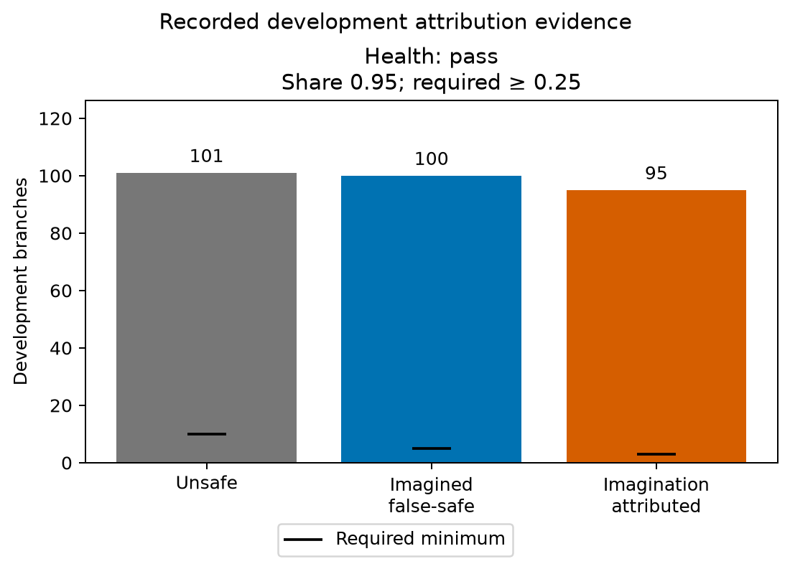
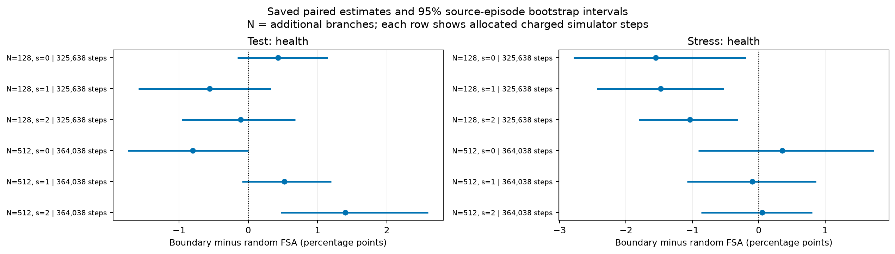

# Walker S4: Completed acquisition comparison

Run: `walker2d-s4-recovery-20260927-1`.

## Saved development gate

| Rule | Branches | Unsafe | Imagined false-safe | Imagination attributed | Share | Saved result |
| --- | --- | --- | --- | --- | --- | --- |
| health | 192 | 101 | 100 | 95 | 0.95 | pass |

Recorded thresholds: unsafe ≥ 10; false-safe ≥ 5; imagination-attributed ≥ 3; share ≥ 0.25.

This is the completed prospective random-versus-boundary acquisition grid. Each model uses its own saved development-calibrated margin, unchanged on test/stress. The no-update rows are the separately evaluated no-update model, not a substitution of the baseline decomposition measurements.

## Paired acquisition estimates

Contrasts are boundary minus random FSA; negative values favor boundary. Intervals are the saved 95% bootstrap intervals clustered by source episode. Seeds remain separate. No averages, intervals or new directional claims are estimated here. An undefined full-data point stays undefined even when some bootstrap replicates are usable.

### Test: health

| Additional branches | Seed | Charged steps | Δ FSA | 95% interval | Saved direction | Undefined reason | Usable bootstrap | Source episodes |
| --- | --- | --- | --- | --- | --- | --- | --- | --- |
| 128 | 0 | 325638 | 0.00427517 | [-0.00154621, 0.0114726] | inconclusive | n/a | 1000/1000 | 64 |
| 128 | 1 | 325638 | -0.00559395 | [-0.0158294, 0.00326114] | inconclusive | n/a | 1000/1000 | 64 |
| 128 | 2 | 325638 | -0.00111916 | [-0.00958661, 0.00675885] | inconclusive | n/a | 1000/1000 | 64 |
| 512 | 0 | 364038 | -0.00802699 | [-0.0173725, 0] | inconclusive | n/a | 1000/1000 | 64 |
| 512 | 1 | 364038 | 0.00521529 | [-0.000906634, 0.011977] | inconclusive | n/a | 1000/1000 | 64 |
| 512 | 2 | 364038 | 0.0139865 | [0.00472332, 0.0259752] | increase | n/a | 1000/1000 | 64 |

| Model | Seed | Additional branches | Margin | Branches | Accepted | Unsafe accepted | Accepted unresolved | Acceptance rate | FSA |
| --- | --- | --- | --- | --- | --- | --- | --- | --- | --- |
| No update | n/a | n/a | 0.0492355 | 512 | 504 | 225 | 0 | 0.984375 | 0.446429 |
| Random | 0 | 128 | -2.97387 | 512 | 496 | 216 | 0 | 0.96875 | 0.435484 |
| Boundary | 0 | 128 | -3.15922 | 512 | 498 | 219 | 0 | 0.972656 | 0.439759 |
| Random | 1 | 128 | -3.36858 | 512 | 502 | 220 | 0 | 0.980469 | 0.438247 |
| Boundary | 1 | 128 | -3.10392 | 512 | 490 | 212 | 0 | 0.957031 | 0.432653 |
| Random | 2 | 128 | -3.36877 | 512 | 498 | 221 | 0 | 0.972656 | 0.443775 |
| Boundary | 2 | 128 | -3.28172 | 512 | 497 | 220 | 0 | 0.970703 | 0.442656 |
| Random | 0 | 512 | -3.25692 | 512 | 495 | 218 | 0 | 0.966797 | 0.440404 |
| Boundary | 0 | 512 | -3.10847 | 512 | 488 | 211 | 0 | 0.953125 | 0.432377 |
| Random | 1 | 512 | -3.26319 | 512 | 492 | 211 | 0 | 0.960938 | 0.428862 |
| Boundary | 1 | 512 | -3.23264 | 512 | 493 | 214 | 0 | 0.962891 | 0.434077 |
| Random | 2 | 512 | -3.30136 | 512 | 488 | 212 | 0 | 0.953125 | 0.434426 |
| Boundary | 2 | 512 | -3.46114 | 512 | 504 | 226 | 0 | 0.984375 | 0.448413 |

### Stress: health

| Additional branches | Seed | Charged steps | Δ FSA | 95% interval | Saved direction | Undefined reason | Usable bootstrap | Source episodes |
| --- | --- | --- | --- | --- | --- | --- | --- | --- |
| 128 | 0 | 325638 | -0.0154989 | [-0.0278673, -0.00192958] | decrease | n/a | 1000/1000 | 64 |
| 128 | 1 | 325638 | -0.0147794 | [-0.024363, -0.00525334] | decrease | n/a | 1000/1000 | 64 |
| 128 | 2 | 325638 | -0.0103798 | [-0.0180536, -0.00316356] | decrease | n/a | 1000/1000 | 64 |
| 512 | 0 | 364038 | 0.00356737 | [-0.00910959, 0.0173659] | inconclusive | n/a | 1000/1000 | 64 |
| 512 | 1 | 364038 | -0.000990722 | [-0.0107732, 0.0086599] | inconclusive | n/a | 1000/1000 | 64 |
| 512 | 2 | 364038 | 0.000512295 | [-0.00866183, 0.00808129] | inconclusive | n/a | 1000/1000 | 64 |

| Model | Seed | Additional branches | Margin | Branches | Accepted | Unsafe accepted | Accepted unresolved | Acceptance rate | FSA |
| --- | --- | --- | --- | --- | --- | --- | --- | --- | --- |
| No update | n/a | n/a | 0.0492355 | 512 | 494 | 358 | 0 | 0.964844 | 0.724696 |
| Random | 0 | 128 | -2.97387 | 512 | 471 | 337 | 0 | 0.919922 | 0.715499 |
| Boundary | 0 | 128 | -3.15922 | 512 | 450 | 315 | 0 | 0.878906 | 0.7 |
| Random | 1 | 128 | -3.36858 | 512 | 470 | 335 | 0 | 0.917969 | 0.712766 |
| Boundary | 1 | 128 | -3.10392 | 512 | 447 | 312 | 0 | 0.873047 | 0.697987 |
| Random | 2 | 128 | -3.36877 | 512 | 487 | 351 | 0 | 0.951172 | 0.720739 |
| Boundary | 2 | 128 | -3.28172 | 512 | 473 | 336 | 0 | 0.923828 | 0.710359 |
| Random | 0 | 512 | -3.25692 | 512 | 457 | 320 | 0 | 0.892578 | 0.700219 |
| Boundary | 0 | 512 | -3.10847 | 512 | 449 | 316 | 0 | 0.876953 | 0.703786 |
| Random | 1 | 512 | -3.26319 | 512 | 464 | 329 | 0 | 0.90625 | 0.709052 |
| Boundary | 1 | 512 | -3.23264 | 512 | 459 | 325 | 0 | 0.896484 | 0.708061 |
| Random | 2 | 512 | -3.30136 | 512 | 480 | 345 | 0 | 0.9375 | 0.71875 |
| Boundary | 2 | 512 | -3.46114 | 512 | 488 | 351 | 0 | 0.953125 | 0.719262 |

## Recorded costs

Charged steps allocate source-pool generation plus paid common-seed branches plus acquired branches to each comparison. Budgets are cumulative, and shared costs recur in rows; summing this table would double-count experience. These are comparison allocations, not a lifetime simulator total. Candidate queries and optimizer updates are separate costs.

| Arm | Seed | Additional branches | Source steps | Seed steps | Acquired steps | Charged steps | Optimizer updates | Candidate queries | Training seconds |
| --- | --- | --- | --- | --- | --- | --- | --- | --- | --- |
| random | 0 | 128 | 300038 | 12800 | 12800 | 325638 | 1500 | 0 | 202.784 |
| random | 0 | 512 | 300038 | 12800 | 51200 | 364038 | 1500 | 0 | 201.414 |
| random | 1 | 128 | 300038 | 12800 | 12800 | 325638 | 1500 | 0 | 198.394 |
| random | 1 | 512 | 300038 | 12800 | 51200 | 364038 | 1500 | 0 | 200.187 |
| random | 2 | 128 | 300038 | 12800 | 12800 | 325638 | 1500 | 0 | 207.047 |
| random | 2 | 512 | 300038 | 12800 | 51200 | 364038 | 1500 | 0 | 202.57 |
| boundary | 0 | 128 | 300038 | 12800 | 12800 | 325638 | 1500 | 640 | 200.88 |
| boundary | 0 | 512 | 300038 | 12800 | 51200 | 364038 | 1500 | 1152 | 198.457 |
| boundary | 1 | 128 | 300038 | 12800 | 12800 | 325638 | 1500 | 640 | 203.703 |
| boundary | 1 | 512 | 300038 | 12800 | 51200 | 364038 | 1500 | 1152 | 200.747 |
| boundary | 2 | 128 | 300038 | 12800 | 12800 | 325638 | 1500 | 640 | 198.731 |
| boundary | 2 | 512 | 300038 | 12800 | 51200 | 364038 | 1500 | 1152 | 200.149 |

Separately recorded evaluation-bank construction: 121600 simulator steps.

## Scope and provenance

FSA is unsafe accepted / all accepted. Zero acceptance and unresolved accepted futures do not acquire a zero estimate. Nonfinite values display as undefined and become null in presentation JSON. The saved scientific gate is unchanged. Input/source hashes and completed workflow output identities are in `manifest.json`. No model, simulator, network, new bootstrap or final-outcome selection was used. This presentation validates saved report consistency and identities; it does not independently reproduce the underlying simulator or model measurements.
